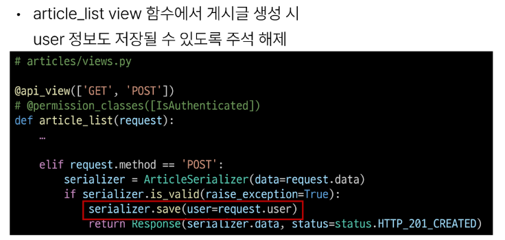
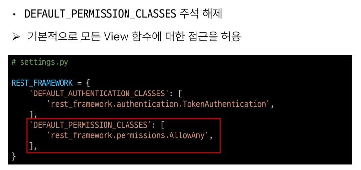

# 1115 TIL

## 잡다한 것

- [Welcome to dj-rest-auth’s documentation! &#8212; dj-rest-auth 5.0.1 documentation](https://dj-rest-auth.readthedocs.io/en/latest/)

- CSRF Token이 빠진 이유: 신청서를 vue에서 보내서?

## Vue with DRF 2

### DRF Authentication

#### 개요

- 시작하기 전에
  
  
  
  

#### Authentication

- 인증과 권한
  

- DRF 에서의 인증
  

- 승인되지 않은 응답 및 금지된 응답
  

#### 인증 체계 설정

- 인증 체계 설정 방법
  
1. 전역 설정
   

2. View 함수 별 설정
   
- DRF가 제공하는 인증 체계
  

- TokenAuthentication
  

#### TokenAuthentication 설정

- TokenAuthentication 적용 과정
  
1. 인증 클래스 설정
   

2. INSTALLED_APPS 추가
   

3. Migrate 진행
   

4. 토큰 생성 코드 작성
   

#### Dj-Rest-Auth 라이브러리

- Dj-Rest-Auth
  

- Dj-Rest-Auth 설치 및 적용
  
  
  

- Dj-Rest-Auth의 Registration(등록) 기능 추가 설정
  

- Registration 기능 추가
  
  
  
  

#### Token 발급 및 활용

- Token 발급
  
  
  
  
  

- Token 활용
  
  
  

- 클라이언트가 Token으로 인증 받는 방법
  

#### 권한 정책 설정

- 권한 정책 설정
  
1. 전역 설정
   

2. View 함수 별 설정
   
- DRF가 제공하는 권한 정책
  

- IsAuthenticated 권한
  

#### IsAuthenticated 권한 설정

- 권한 설정
  
  

- 권한 활용
  
  
  

### Authentication with Vue

- 시작하기 전에
  

#### 회원가입

- 회원가입 로직 구현
  
  
  
  
  
  
  
  
  
  

#### 로그인

- 로그인 로직 구현
  
  
  
  
  
  
  
  
  

#### 요청과 토큰

- 토큰 저장 로직 구현
  
  

- 토큰이 필요한 요청
  

- 게시글 전체 목록 조회 with token
  
  

- 게시글 작성 with token
  
  

#### 인증 여부 확인

- 사용자의 인증(로그인)여부에 따른 추가 기능 구현
  

- 인증 상태 여부를 나타낼 속성 값 지정
  
1. 인증 되지 않은 사용자는 메인 페이지 접근 제한
   
   

2. 인증 된 사용자는 회원가입과 로그인 페이지에 접근 제한
   
   

#### 기타 기능 구현

- 자연스러운 애플리케이션을 위한 기타 기능 구현
  
1. 로그인 성공 후 자동으로 메인 페이지로 이동하기
   

2. 회원가입 성공 후 자동으로 로그인까지 진행하기
   

### 참고

