# 0724 TIL

## 잡다한 것

- sort 메서드와 sorted함수의 차이점 
  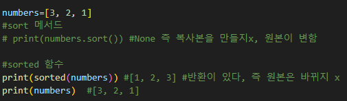
  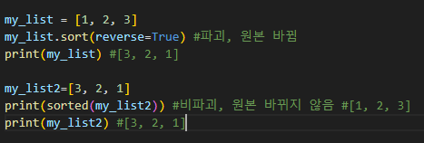

- 할당과 슬라이싱의 차이점(0724(월, 데이터구조1) 다시보기의 극 후반part)
  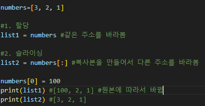

- 리스트 슬라이싱은 오류 뜨면 빈 리스트가 나온다.

- 클래스는 붕어빵 틀, 객체는 붕어빵

- 1Byte= 영문 한문자를 처리하는 데 필요로 하는 양
  한글은 2Byte이다.

- 연결 리스트에 대해 알아볼 것(면접 때 물어본단다.)(근데 파이썬은 없다는데?)

- 불변인 str을 리스트를 활용해서 바꾸기
  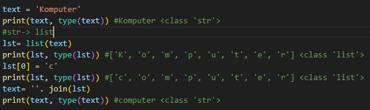

- 참고
  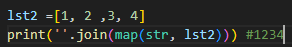

- count 함수 직접 만들어 보기
  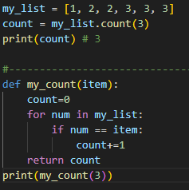

- 파이썬에서는 a,b 값을 서로 바꾸는데에 새로운 변수 필요 x
  `a, b = b, a`

---

## Data Structure

### Data Structure

- 메서드
  
  - 객체에 속한 함수
  
  - 객체의 상태를 조작하거나 동작을 수행
  
  - 메서드 특징
    
    - 메서드는 클래스(class) 내부에 정의되는 함수
    
    - 클래스는 파이썬에서 '**타입을 표현하는 방법**'
      
      - ex) help함수를 통해 str을 호출해보면 class임을 알 수 있다.
  
  - 메서드는 어딘가(클래스)에 속해 있는 함수이며, 각 데이터 타입별로 다양한 기능을 가진 메서드가 존재
  
  - 메서드 호출 방법
    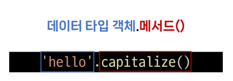

---

### 시퀀스 데이터 구조

- 문자열
  
  - 문자열 조회/탐색 및 검증 메서드
    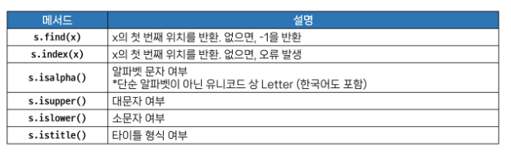
    
    - `.find(x)`
      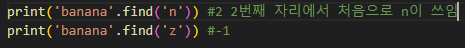
      
      - x의 첫번째 위치를 반환
      
      - 없을 시 **에러 발생하지 않고 -1으로 반환**
      
      - 조심해야 될 것은 -1이 나와서 맨 뒤로 착각 할 수 있다.
    
    - `.index(x)`
      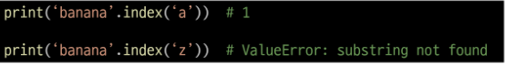
      
      - x의 첫번째 위치를 반환
      
      - 없을 시 **오류발생**
    
    - `.isupper(x)` ,`.islower(x)`
      
      - 문자열이 **모두** 대문자/소문자로 이루어져 있는지 확인
    
    - `.isalpha(x)`
      
      - 문자열이 알파벳으로만 이루어져 있는지 확인
      - 한글도 된다고 한다.
    
    - `.title()`
      
      - 아래의 `.istitle(x)`를 알기위해 찾아 봄
      
      - 단어가 대문자로 시작하고 나머지 문자는 소문자가 되도록 문자열의 제목 케이스 버전을 돌려줍니다.
    
    - `.istitle(x)`
      
      - 문자열이 제목 케이스 문자열이고 하나 이상의 문자가 있는 경우 `True`를 돌려줍니다.  예를 들어 대문자 앞에는 케이스 없는 문자만 올 수 있고 소문자는 케이스 문자 뒤에만 올 수 있습니다. 그렇지 않은 경우는 `False`를 돌려줍니다.
  
  - 문자열 조작 메서드(새 문자열 반환) (비파괴라 리턴 받아서 써야 함)
    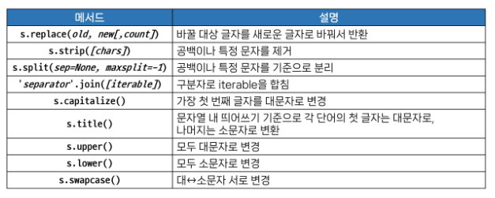
    
    - 비파괴라 리턴 받아야 한다는 것에 대한 예제? 설명
      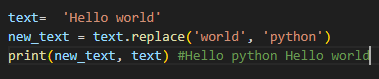
    
    - `.replace(old, new[,count])` (여기서 `[]`내에 있는것는 필수 인자가 아닌 선택인자를 의미)
      
      - 바꿀 대상 글자를 새로운 글자로 바꿔서 반환
        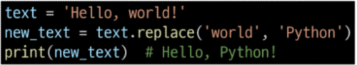
    
    - `.strip([chars])`
      
      - 문자열의 시작과 끝에 있는 공백 혹은 지정한 문자를 제거
        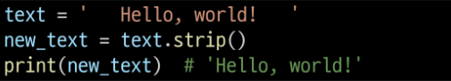
      
      - 공백 있다고 오류 뜨는지 테스트 하는 변태들이 있다.
      
      - 그러면 선택 인자를 기입해서 지정한 것을 제거하는 것은 어떻게 할 수있을까 테스트 해보기
    
    - `.split(sep=None, maxsplit=-1)`(많이 쓰임)
      
      - 지정한 문자를 구분자로 문자열을 분리하여 문자열의 리스트로 반환
        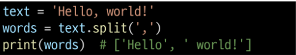
    
    - `'separator'.join([iterable])`(많이 쓰임)
      
      - iterable 요소들을 원래의 문자열을 구분자로 이용하여 하나의 문자열로 연결
        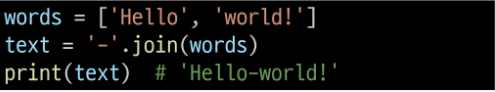
    
    - 짜잘한 것
      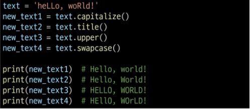
    
    - 메서드는 이어서 사용 가능
      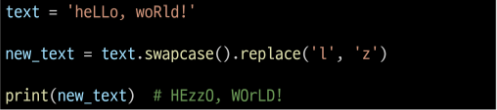

- 리스트
  
  - 리스트 값 추가 및 삭제 메서드
    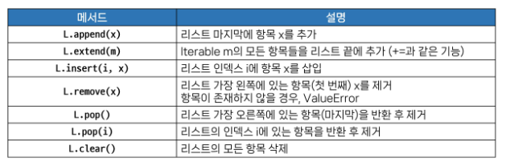
    
    - `.append(x)`(많이 쓰임)
      
      - 리스트 마지막에 항목x를 추가
    
    - `.extend(iterable)`(많이 쓰임)
      
      - 리스트에 다른 반복 가능한 객체의 모든 항목을 추가
      - `.extend(반복가능한 객체)`이므로 반복가능한 객체가 아닌 int같은 것은 안된다. 리스트로 묶어주고 더하던가 할 것!
    
    - `.append(x)`와 `.extend(iterable)`의 차이점
      
      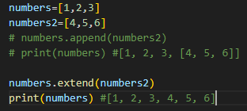
    
    - `.insert(i,x)`
      
      - 리스트의 지정한 인덱스1 위치에 항목 x를 삽입
      
      - 속도 저하가 있음(웬만하면 쓰지 말도록)
    
    - `.remove(x)`
      
      - 리스트에서 첫 번째로 일치하는 항목을 삭제
      - 리스트 **가장 왼쪽**에 있는 항목 x를 제거
    
    - `.pop(i)`(많이 쓰임)
      
      - 리스트에서 지정한 인덱스의 항목을 제거하고 **반환**
      
      - 작성하지 않은 경우 마지막 항목을 제거
      
      - 뭐가 삭제 되었는지를 반환값으로 받아서 써 먹을 수 있다.
      
      - 어정쩡한 위치의 것 빼면 느려짐
        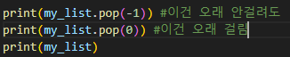
    
    - `.clear()`
      
      - 리스트의 모든 항목을 삭제
    
    - 리스트 탐색 및 정렬 메서드
      아래의 그림에서  reverse(): ~~거꾸로 정렬~~이 아닌 <u>순서 역순으로 변경</u>임
      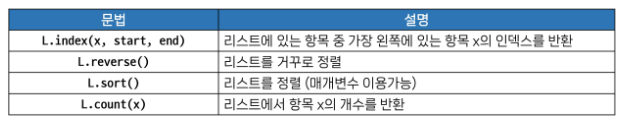
    
    - `.index(x)`
      
      - 리스트에서 첫 번째로 일치하는 항목의 **인덱스를 반환**(값을 반환 하는 것이 아니라 인덱스를 반환)
      
      - 없으면? 우예될까 테스트 하기 -> 이것도 에러 남
    
    - `.count(x)`
      
      - 리스트에서 항목 x가 등장하는 횟수를 반환
    
    - `.sort()`(많이 쓰임)<- 기본인자로 `reverse=False`였음을 알 수 있음(cf)
      
      - 이것도 속도 절감이 좀 있음
      
      - 원본 리스트를 오름차순으로 정렬(반환 없음을 알 수 있다, 원본이 변경됨)
      
      - 내림차순 하는 법(아래)
        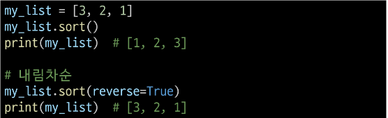
      
      - 추가내용
        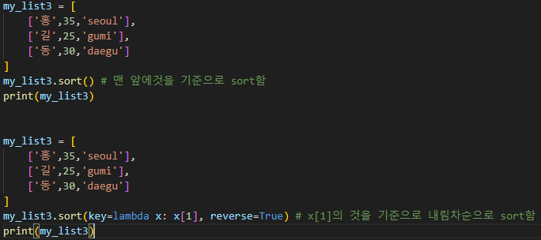
    
    - `.reverse()`(많이 쓰임)
      
      - 리스트의 순서를 역순으로 변경(**정렬X**)
      
      - 오로지 순서를 뒤집기만 함, 오름차순, 내림차순 같은 것 아님

- 참고
  
  - 문자열에 포함된 문자들의 유형을 판별하는 메서드
    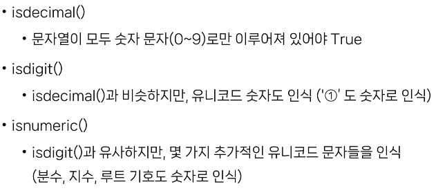
    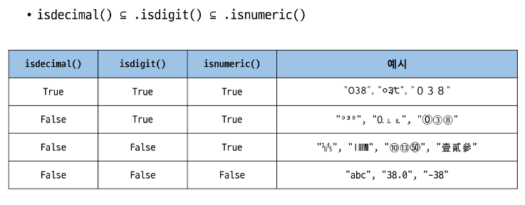
