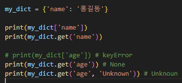

# 0725 TIL

## 잡다한 것

- 딕셔너리 key는 왜 value와 달리 모든 것이 사용 불가하고 제한 되어 있었냐? (불변인 것만)
  
  해시 가능성이 없어서...(고정되지 않음)(여기 약간 놓침 리스트 어쩌고 하던데...)

- 오늘 다시보기를 보고 다시 정리 필요

- 연습
  

- 

---

## Data Structure2

### 비시퀀스 데이터 구조

- set
  
  - 세트 메서드
    
    
    - `.add(x)`
      
      - 세트에 x를 추가
      
      - 이미 x가 있으면 변화 없음
      
      - set은 `.append()`없음
    
    - `.clear()`
      
      - 세트의 모든 항목을 제거
        
        
        출력 값이 `set()`으로 나오는 이유는 딕셔너리와 혼동 방지를 위해
    
    - `.remove(x)`
      
      - 세트 s에서 항목 x를 제거 (항목 x가 없으면 에러 발생)
        
    
    - `.discard(x)`
      
      - 세트 s에서 항목 x를 제거 (에러 없음)
      
      - 에러를 출력하지 않고 리턴값이 없으므로 `print(my_set.discard(10)`해주면 `None`이 나옴
    
    - `.pop()`(참고 인 부분이 많지만 더 자세히 알고 싶으면 다시보기 참조) (해쉬 관련)
      
      - 세트에서 **임의의** 요소를 제거하고 **반환**
      
      - 실행할 때마다 다른 요소를 얻는다는 의미에서의 무작위가 아니라 임의라는 의미에서의 무작위
      
      - 보통 탐색 시간 절약을 위해 해쉬 테이블 순서 순으로 나옴 
      
      - 정수는 정수 값 자체가 해쉬값이므로 다시 `pop()`써도 똑같은 값으로 나옴
      
      - 문자열은 문자열은 매번 실행될 때마다 다른 해쉬 값을 얻게 되어(왜냐하면 문자열은 가변적인 길이를 가지고 있으므로) `pop()` 쓸 때마다 바뀜
      
      - 문자열은 해쉬 테이블의 어떤 위치에 들어갈 지 알 수 X
      
      - 하지만 정수는 해쉬 테이블의 위치가 거의 정해짐
      
      - cf)딕셔너리의 키는 고유해야 하므로, 키를 해쉬 함수를 통해 해시 값으로 변환 하여 해시 테이블에 저장
    
    - `.update(iterable)`
      
      - `.extend`와 유사
      
      - 세트에 다른 iterable요소를 추가
        
  
  - 세트의 집합 메서드
    
    

- dictionary
  
  - 딕셔너리 메서드
    
    
    - `.clear()`
      
      - 딕셔너리 D의 모든 키/값 쌍을 제거
    
    - `.get(key[, default])`(많이 쓰임)
      
      - 키 연결된 값을 반환하거나 키가 없으면 None 혹은 기본 값을 반환
        
      
      - get을 쓰면 좋은 점
        
    
    - `.keys()`(많이 쓰임)
      
      - 딕셔너리 키를 모은 객체를 반환
    
    - `.values()`(많이 쓰임)
      
      - 딕셔너리 값을 모든 객체를 반환
    
    - `.items()`(많이 쓰임)
      
      - 딕셔너리 키/값 쌍을 모은 객체를 반환
    
    - 위의 3개의 예제
      
    
    - `.pop(key[, default])`
      
      - 키를 제거하고 연결됐던 값을 반환(없으면 에러나 default를 반환)
        
    
    - `.setdefault(key[, default])`
      
      - 키와 연결된 값을 반환 (get과 유사)
      
      - **키가 없다면 default와 연결한 키를 딕쳐너리에 추가하고 default를 반환**
      
      - 이미 있으면은 변환 안함
        
    
    - `.update([other])`
      
      - other가 제공하는 키/값 쌍으로 딕셔너리를 갱신 
      
      - 없는 키도 넣을 수 O
      
      - 기본 키는 **덮어씀**
        

### 복사

- 복사 예
  

