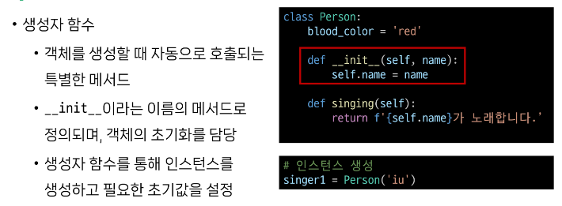
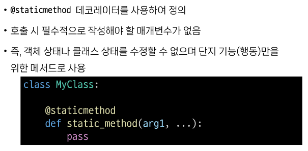
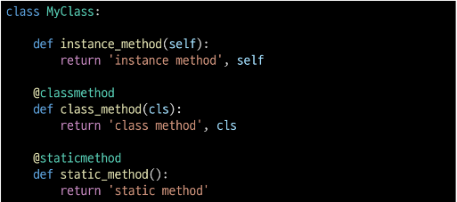

# 0726 TIL

## 잡다한 것

다시보기 볼 것

- 딱히 막아놓지 않아서 할 수는 있지만 그렇게 하지 말아야 하는 것이 있다.
  

- 배열이나 리스트(가변) 같은 것들은 참조(원본 안 바뀜)해오는 이유는 값(용량)이 크기 때문에 똑같이 값 복제하기엔 부담스러워서

- `.____, .____()`뒤에 괄호가 없으면 속성(변수) 이고 ()가 있으면 메서드

- 클래스와 객체, 객체와 인스턴스 의 차이점 알기

---

## OOP 1

### Classes

### 객체지향 프로그래밍(OOP)

#### 절차 지향 프로그래밍

- 프로그램을 '데이터'와 '절차'로 구성하는 방식의 프로그래밍 패러다임

- 특징: 
  
  - "데이터"와 해당 데이터를 처리하는 "함수(절차)"가 분리되어 있으며, **함수 호출의 흐름이 중요**
  
  - 코드의 순차적인 흐름과 함수 호출에 의해 프로그램이 진행
  
  - 특징
    

- 소프트웨어 위기
  
  - 너무 복잡해짐 (객체 지향 프로그래밍의 탄생)

#### 객제 지향 프로그래밍

- 데이터와 해당 데이터를 조작하는 조작하는 메서드를 **하나의 객체**로 묶어 관리하는 방식의 프로그래밍 패러다임

- 절차 지향 vs 객체 지향
  
  데이터들의 공통점을 하나의 상위 클래스로 묶었고 그 클래스를 기반으로 그 하위 클래스를 생성했다. 그리고 그 하위 클래스들을 커스텀 했다. 
  
  
  
  cf) 절차 지향=> `함수(데이터)`
  
     객체 지향=> `데이터(객체). 메서드` 이렇게 주체가 바뀜
  
  **즉, 절차 지향은 함수가 중심, 객체 지향은 객체가 중심** 
  
  ---

### 객체

#### 클래스

- 클래스
  
  - 파이썬에서 **타입**을 표현하는 방법
  
  - **객체를 생성**하기 위한 설계도
  
  - 데이터와 기능을 함께 묶는 방법을 제공
  
  - 데이터와 메서드를 포함하고 있다.

- 객체
  
  - 클래스에서 정의한 것을 토대로 메모리에 할당된 것
  
  - "**속성**"과 "**행동**"으로 구성된 모든 것
  
  - ex)
    

- 클래스와 객체
  
  
  
  - 클래스를 만든다==**타입**을 만든다.
    
    `Alice`는 결국 클래스 str의 인스턴스 였던것이다.

- 인스턴스와 메서드
  
  - `hello.upper()` : (문자열이라고 하는 클래스의)인스턴스.메서드()
  
  - 하나의 객체(object)는 특정 타입의 인스턴스이다.
    

- 객체의 특징
  

- 클래스 구조
  
  클래스는 찍어내기만 할 뿐이고 실질적으로는 인스턴스가 행동하고 동작한다.

- 클래스 기본 활용
  
  
  
  ex
  

- 인스턴스와 클래스 간의 이름 공간
  
  
  
  인스턴스는 서로 공유하지 않고 각자 독립적으로 존재(p1, p2)
  
  - 예시(기억할 것!!)(인스턴스 변수 정의하는 법)
    
  
  - 인스턴스 이름 설정이 안 되어 있으면 클래스로 찾아 올라가서 이름을 받음
  
  - 나중에 name을 설정해주면 이때부터는 인스턴트의 name이 만들어 졌기 때문에 클래스의 name을 찾아가 쓰지 않음
  
  - 그러나 이렇게 인스턴스의 이름이 없어서 클래스까지 찾아올라가서 이름을 쓰는 것은 별로 좋은 코드가 아님

- 독립적인 이름공간을 가지는 이점
  
  참고)
  

#### 인스턴스 변수와 클래스 변수

- 클래스 변수 활용(기억하기!)
  
  위에것을 보면, 모든 인스턴스는 name이라는 인스턴스 변수를 가지고 생성됨 
  
  그리고 카운트를 통해 총 몇명이 생성되었는지 알 수 있게 가능(생성시 `__init__`이 호출 됨을 이용)

- 클래스 변수를 변경할 때는 항상 `클래스.클래스변수` 형식으로 변경
  
  
  클래스 변수에 인스턴스로 접근은 가능은 함, 하지만 인스턴스가 수정하는 것은 불가, 클래스 변수 조작 시 클래스가 조작하도록 해야 함(cf) 인스턴스 변수 변경을 하면 본인만의 속성만 바뀜)

#### 메서드

- 메서드(행동) 종류
  
  - 인스턴스 메서드
  
  - 클래스 메서드
  
  - 정적 메서드

- 인스턴스 메서드
  
  - 클래스로부터 생성된 각 인스턴스에서 호출할 수 있는 메서드
    
    - 인스턴스의 상태를 조작하거나 동작을 수행
  
  - 인스턴스 메서드 구조
    
    self 말고 딴 거 써도 되는데 암묵적인 약속임
  
  - self 동작원리
    
    
    
    
    만약에 인스턴스의 self가 없다면 인스턴스 메서드의 가치가 없어짐 `str.upper(해당부분)`해당부분에 자기자신이 들어가야하는데 들어가는 게 없으므로 진행이 안됨 

- 생성자 메서드
  
  - 인스턴스 객체가 생성될 때 자동으로 호출되는 메서드
    
    - 인스턴스 변수들의 초기값을 설정
  
  - 구조
    
    초기값이 없더라도 써 주는 것을 권장(pass라도 두더라도)

- 클래스 메서드
  
  - 클래스가 호출하는 메서드
    
    - 클래스 변수를 조작하거나 클래스 레벨의 동작을 수행
  
  - 구조
    
    
    여기서 cls는 호출하는 클래스를 의미(자기자신 아님... 상속관련..)(내일 할 것이라 이후 공부)
    
    이것도 cls말고 딴 것 써도 되지만, 암묵적인 약속
    
    왜 cls라고 하냐? (상속때문에)
    
    ~~데코레이터 이것 하나 때문에 메서드의 성향 바뀜, 없었으면 인스턴스 메서드로 해석되었을 것~~
    데코레이터의 역할은 이 함수의 원본은 유지하면서 추가적인 기능을 붙여주는 역할
    
    여기서의 데코레이터의 역할은 이 인스턴스 메소드를 클래스 메소드로 쓸 수 있게 해주는 역할 
  
  - 예시
    

- 스태틱(정적) 메서드
  
  - 클래스와 인스턴스와 상관없이 독립적으로 동작하는 메서드
    
    - 주로 클래스와 관련이 있지만 인스턴스와 상호작용이 필요하지 않은 경우에 사용
  
  - 구조
    
    여기서도 데코레이터가 없다면 인스턴스로 인식
    평소에 쓰던 것처럼 **필수적으로 작성해야 할 매개변수 없음**
    
    어떠한 하나의 목적에 대한 행동에 기준을 둠
  
  - 예시
    

- 메서드 정리
  
  
  - 각자의 역할
    
    인스턴스는 클래스 메서드, 스태틱 메서드 둘 다 호출은 가능, 그렇지만 하지마시오
  
  - 예시
    
  
  - 클래스가 할 수 있는 것
    

- 인스턴스가 할 수 있는 것
  

---

#### 참고

- 매직 메서드
  
  
  - 예시
    
    `__str__` => `<object xxxxx  >` 이걸 위와 같이 바꿔줌

- 데코데이터
  
