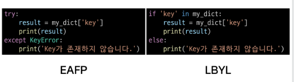
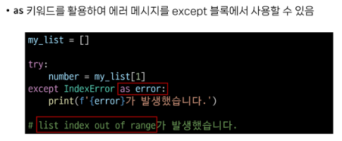

# 0727 TIL

## 잡다한 것

- git 포크 설정하기
- 목욜 종합 정리 기록하기
- 클래스 변수는 한번만 초기화 됨(공용이므로?)

---

## OOP2

### Classes 상속

#### 상속

- 기존 클래스의 속성(변수)과 메서드를 물려받아 새로운 하위 클래스를 생성하는 것

- 상속이 필요한 이유
  
  

- 클래스 상속
  
  - 좀 더 세분화(계층 구조) 하기 편함, 상속 없이도 불가능 한건 아닌데  복잡해짐...
  
  - 또 쓸때 없이 중복되는 것을 방지 가능
  
  - 상속을 사용한 계층구조 변경
    
    
    하위 클래스를 형성할 때 `()` 안에 부모 클래스의 이름을 써주면 된다.
  
  - super()을 사용하기
    부모 클래스의 메서드를 호출하기 위해 사용되는 내장 함수
    ex
    
  
  - 다중 상속
    
    - 두 개 이상의 클래스를 상속 받는 경우
    
    - 상속받은 모든 클래스의 요소를 활용 가능함
    
    - 중복된 속성이나 메서드가 있는 경우 상속 순서에 의해 결정됨
    
    ex)
    
    오버라이딩과 오버로딩 찾아보기
  
  - 상속 관련 함수와 메서드
    

---

#### Errors & Exception

- 디버깅

- 에러
  
  - 에러 유형(굳이 여기 기입은 안 하지만 찾아볼 것)
    

- 예외 처리
  
  - try와 except
    
    - 파이썬에서는 "try"와 "excepy" 절을 사용하여 예외 처리
    
    - try-except 구조
      
      
      - `if`는 확인하고 진행하는 데, `try`은 일단 진행하는 느낌
    
    - 복수 예외 처리도 가능
      
    
    - 주의사항
      
      - 내장 예외 클래스는 상속 계층구조를 가지기 때문에 except 절로 분기 시 **반드시 하위 클래스를 먼저 확인 할 수 있도록 작성해야 함**   
      - 그냥 exception 써라 잘 모르면(알면 자세하게 쓰던지)

- EAFP & LBYL (위의 것은 if문이랑 뭐라 다른거야? 관련 내용)
  
  - EAFP(일단 지르고 나중에 용서를 구하겠다, except)
    
    
  
  - LBYL(도약하기 전에 검사먼저, if문)
    
  
  - 접근 방식 비교
    
    
    

---

#### 참고

- as 키워드
  
