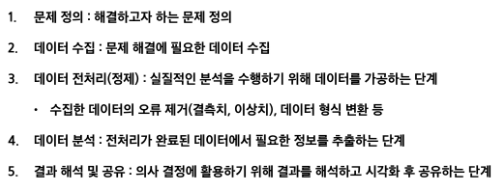
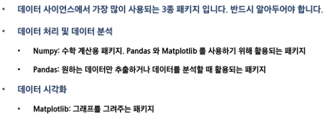
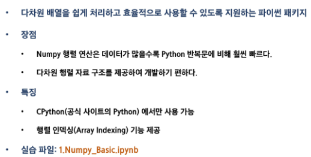
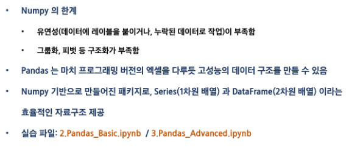
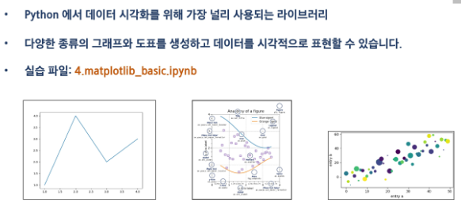

# 0728 TIL

## 잡다한 것

---

## PJT

### 데이터 사이언스

- 다양한 데이터로부터 새로운 지식과 정보(문제해결에 필요한 지식)를 추출하기 위한 분야

- 필요한 정보 추출하는 5가지 단계
  

- 자주 활용되는 파이썬 패키지
  
  
  
  - Numpy(빠르게 다룰려고) - 다차원 배열 조작
    
  
  - Pandas(편리하게 다룰려고) - 전처리 분석
    
  
  - Matplotlib
    

---

