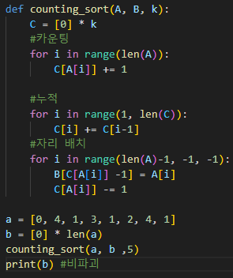

# 0731 TIL_0801 TIL

## 잡다한 것

- `Shift + F10`: PyCharm  터미널 생성

- 2020.3.5 버전 파이참 다운로드

- `range(0, N)`: 0이상 N미만 (0부터 N-1까지 나옴)
  `range(N, 0, -1)`: N이하 0초과 (N부터 1까지 나옴)

- baby - gin
  
  - 트리플 먼저 하고 런 해야 오류 x (런 먼저 시 오류 발생 ex 3 1 1 1)
  
  - 그러면 6개를 정렬후 반 씩 쪼개서 판단한다면?(오류 예 1 1 2 2 3 3) 

- continue 이용 예(위의 if문에 해당하면 밑에 것이 실행되면 안 될 때 이용)
  

---

## 알고리즘

- 알고리즘의 성능 분석 필요
  
  - 많은 문제에서 성능 분석의 기준으로 알고리즘의 작업량을 비교한다.

- 시간 복잡도 = 빅 - 오(O) 표기
  

### 배열 1(Array 1)

- 배열이란?
  
  - **일정한** 자료형의 변수들을 하나의 이름으로 열거하여 사용하는 자료구조

- 배열의 필요성(참고)
  
  - 프로그램 내에서 여러 개의 변수가 필요할 때, 일일이 다른 변수명을 이용하여 자료에 접근하는 것은 매우 비효율적일 수 있다.
  
  - 배열을 사용하면 하나의 선언을 통해서 둘 이상의 변수를 선언할 수 있다.
  
  - 단순히 다수의 변수 선언을 의미하는 것이 아니라, 다수의 변수로는 하기 힘든 작업을 배열을 활용해 쉽게 가능

- 1차원 배열
  

- 정렬
  
  
  - 정렬의 종류
    
  
  - 버블 정렬
    
    - 인접한 두 개의 원소를 비교하며 계속 교환하는 방식
    
    - 정렬 과정
      
      - 첫 번째 원소부터 **인접한 원소끼리** 계속 자리를 교환하면서 맨 마지막자리까지 이동
      
      - 한 단계가 끝나면 가장 큰 원소가 마지막 자리로 정렬된다.
      
      - 교환하며 자리를 이동하는 모습이 물 위에 올라오는 거품 모양과 같다고 하여 버블 정렬이라고 한다.
    
    - 시간 복잡도
      
      - O(n^2)
    
    - 예시(그림을 보고 글로 쓸 줄 알아야 되고 글을 보고 그림을 만들 줄도 알아야 함)
      
      
      
      
      
      
      ~~여기서  `i`구간을 `(0, N-1)`로 한다면 `j` 구간을 `(N-1-i)` 로 하면 됨~~
  
  - 카운팅 정렬
    
    - 항목들의 순서를 결정하기 위해 집합에 각 항목이 몇 개씩 있는지 세는 작업을 하여, 선형 시간에 정렬하는 효율적인 알고리즘
    
    - 빠른 대신에 제약 조건이 좀 있음
    
    - 제한 사항
      
      - n이 비교적 작을 때만 가능
      
      - 정수나 정수로 표현할 수 있는 자료에 대해서만 적용 가능: 각 항목의 발생 회수를 기록하기 위해, 정수 항목으로 인덱스 되는 카운트들의 배열을 사용하기 때문(인덱스는 정수만 가능하므로)
      
      - 카운트들을 위한 충분한 공간을 할당하려면 **집합 내의 가장 큰 정수**를 알아야 한다. (주어진 자료의 갯수로 counts 할당 X)(`counts = [0]*max_v+1`)
    
    - 시간 복잡도
      
      - O(n+k) : n은 리스트 길이(Data의 크기), k는 정수의 최대값(Counts의 크기)
    
    - 예시(기억하기!!)
      
      
      
      누적 느낌
      
      
      뒤에서 부터 가져옴
      `temp`를 하나 만듬(데이터랑 같은 크기로)
      Data에서 1을 보고 counts에서 인덱스 1번꺼를 보고 어? 4번째까진 1이 있겠네?를 파악하고 counts[1]을 감소시키고 Temp의 4번째(인덱스 3번째) 자리에 1을 삽입
      
      
      
      
      
      
      
      
      
      장점: 원본 보존
      
      숫자를 단순히 세서 정렬하는 것이 아니라서 원본 그 자체를 정렬 가능하도록 함(똑같은 1이라도 위치가 있었잖아, 그것까지 고려해줌,  원본의 순서 고려해줌) (다이아몬드 1, 하트 1) (안전 정렬을 위해서 뒤에서 부터 하는 것임) 
      
      
      
      C 만들 때 **k+1**로 곱해줌을 실수 하지 말 것! (0부터 k까지 니깐)
      
      

- 순열
  
