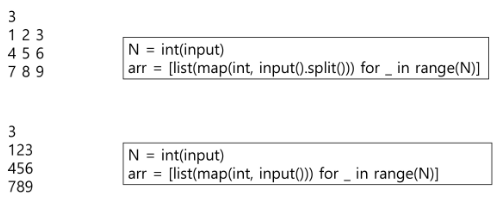
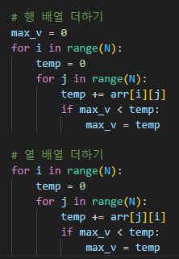
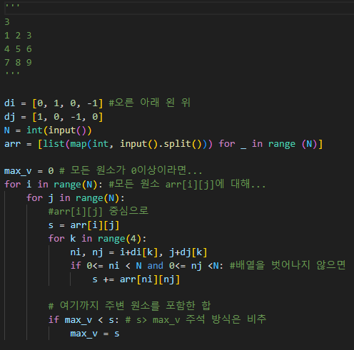
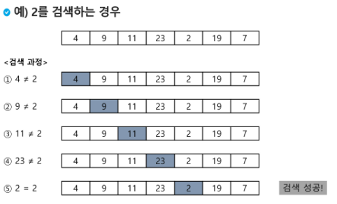
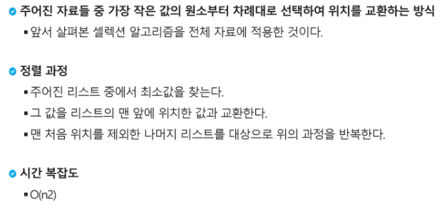

# 0802_0803 TIL

## 잡다한 것

- 입력 받을 때 Tip(이런 것도 가능하다 느낌)(좋은데?)
  
  
  - 좀 더 자세히!(주의!!)
    

- 행의 합 중에서 가장 큰 것 뽑아내기(초기값 위치 잘 볼 것!!)
  
  

- 정사각형에서 행, 열 구할때는 `for i(N), for j(M) `하고 `Array[i][j]`로 행을 구하고 열을 구할 때는 `for i(N), for j(M)`는 그대로 두고 `Array[j][i]`로 해주면 된다.
  
  - 단 위의 방식은 정사각형일 때만 가능, 크기가 다르면 `for j(M), for i(N)` 로 바꾸고 `Array[j][i]`
    - 예
      

- 참고(기억에서 잊을 것)(영으로 채워진 배열 만들 때..)
  

- 참고
  

- 동등한 if 라인이면 변수 같은 것 써도 됨(i , i) 아니! 권장, 나중에 알파벳 부족해짐

- 리스트 앞에 숫자 추가하기
  

- 비트 연산 가지고 놀기
  

- 참고
  
  

- 예시가 한 개 짜리라면 임의로 하나 더 만들어서 내가 만든 형식이 똑바로 되나 파악하기(예를 들어, `print()`를 넣어줘야 할 수도 있음, 안 그러면 계속 옆으로 써질 수도?)

---

## 배열 2(Array 2)

- 2차원 배열
  
  - 2차원 배열의 선언
    
  
  - 2차원 배열의 접근
    
    
    
    지그재그 part:`(m-1-2*j) * (i%2)` 에서`i%2`가 `0`일 때는 `j`가 되도록, `i%2`가 1일 때 `(m-1)-2*j`가 되도록 해서
    
    최종적으론 홀수번 일때는 `j + m - 1` ,짝수 번일 때는 `-j + m - 1`이 됨
    
    내 생각: -1의 제곱 형으로도 비슷하게 만들 수 있지도 않을까?
    
    이렇게 못 만들겠으면 if else로 나눠서 구해줘도 됨(`i % 2`로)
    
    - 대각선(오, 왼) 
      
    
    
    다른 뭔가를 하기 전에 **인덱스 체크를 항상 먼저 해 줘야 됨** 
    
    델타: IM 필수 이기도 하고 많이 쓰임
    
    - 행의 합과 열의 합
      
    
    - 델타 검색(`for i` 위가 전제 합 초기화 위치, `for k` 위가 부분 합 초기화 위치 )
      
      
      
      심화(할 줄 알아야 됨)(칸 늘어나기..)
      
      

- 2차원 배열의 활용
  
  
  `if i < j`이거 없으면 기껏 바꿔 놓은 것을 원래대로 돌려버림
  
  반만 구해야 할 때 많이 쓰임
  
  다른 방식으로도 가능할 것임
  
  - 전치 행렬
    

- 부분 집합 생성
  
  - 부분집합의 수
    
    
  
  - 비트 연산자
    
    
    - 여기서 주의 깊게 봐야할 점은 `&, |`에서 **비트 단위**로 연산을 한다는 것(각 자리의 비트 끼리만 서로 연산)
    
    - `<<, >>` : 밀려난 위치(오른쪽 맨 끝부분)는 `0`으로 채워짐, 왼쪽 끝부분의 값은 그냥 날라가버림
    
    - `2**n` : n번 비트가 1인 값이라고도 함
    
    - `1<<n : 2**n`인 이유 한칸 씩 왼쪽으로 갈 때마다 2씩 곱해지므로
  
  - 위의 방식을 활용해서 생성하는 법
    
    
    `i`
    
    000 {}
    001 {1}
    010 {2}
    011{1, 2}
    100 {3}
    101 {1, 3}
    110 {2, 3}
    111 {1, 2, 3} 이걸 각 비트마다 1이 있는지 찾고 1이 있다면 True로 나옴(`if i & (1<<j)`)
  
  - 검색
    
    
    - 순차 검색
      
      
      - 정렬되어 있지 않은 경우
        
        예시
        
        
        
      
      - 정렬되어 있는 경우
        
        
        예시
        
        위와 비슷하지만 다른 점은? 찾으려는 키 값보다 커지는 경우는 해 볼 필요 x(다 검사할 필요 x)
        
    
    - 이진 검색(중요!!)(업 다운 게임 느낌)
      
      
      
      예시(기억할 것!!)
      
      
      
      
      여기서 while 조건에 =이 없으면 안됨(start와 end가 같을 때도 고려 필요, ~~이땐 middle도 같을 것임~~)(한 칸차이로 빗나갔을 때 생각해보면 됨 )
      
      남은 원소가 없으면 실패
      
      참고
      

- 인덱스(별로 안 중요??)
  
  

- 선택 정렬
  
  젤 작은 애를 맨 앞으로 가져다 놓음
  
  - 과정(기본 소양: **인덱스만 사용하여서** min, ~~max~~ 구할 줄 알아야 덜 복잡해 보임)
    
    
    
    
    
    정렬한 것 초과부터 다음으로 최소값 되는것 찾기
    
    궁금한 것: 왜 큰 값을 먼저 찾지 않았나? 그게 연산 더 적지 않나?
    
      
      
    
    바깥 for은 N-1번만 돌면 된다.
    
      위의 것 할 줄 알아야 됨(중요하단다.) (추가 내용, 기록할 것 0803 후반부분)
    
    - 셀렉션 알고리즘(참고)
      
      
      
      
      선택 정렬과의 차이점, k번째라는 것을 찾으면 끝남
