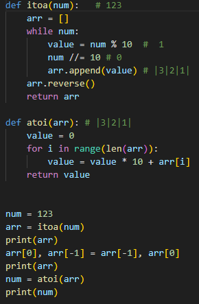
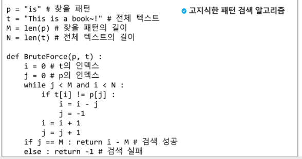
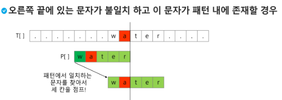

# 0807 TIL

## 잡다한 것

- 너무 큰 출력을 받을 시 꿀팁
  
- 참고(숫자형 리스트 문자열로 만들기)
  
- `for - else 문` : for가 다 돌아간 후에 else문 check, 이거 은근 꿀팁일 듯!!, 근데 이거 파이썬만 있음..
- 이게 뭐니?
  : 잘해봐야
  :무조건 이 정돈 걸린다
  : 최악의 경우

---

## 문자열(string)

### 문자열

- 문자열의 분류 (참고)
  
  

- Python에서의 문자열 처리
  
  

- C와 java의 String 처리의 기본적인 차이점(참고)
  
  
  
  C만 글자수가 아닌 byte 수로 나옴

- 문자열 뒤집기
  
  
  
  for i : 0 -> N//2 -1 , arr[i] <-> arr[N-1-i]
  
  
  
  

- 문자열 비교
  
  
  
  
  
  

- 문자열 숫자를 정수로 변환하기
  
  
  
  - int()와 같은 atoi() 함수 만들기(참고???)
    
    
    
    0+1=>10+2=>120+3
  
  - str()함수를 사용하지 않고, itoa()를 구현해보기(참고가 아니라 알아야 됨..)
    
    
    
    
    

### 패턴 매칭

- 패턴 매칭에 사용되는 알고리즘들
  
  - 고지식한 패턴 검색 알고리즘
  
  - 카프-라빈 알고리즘
  
  - KMP 알고리즘
  
  - 보이어-무어 알고리즘

- 고지식한 알고리즘(할 줄 알아야됨!!)
  
  
  - 알고리즘 설명
    
    
    
    
    위의 방식은 하나라도 찾으면 while문 나옴, 뜯어고쳐서 counts도 되도록 만들어 볼 것!!
    
    `i = i-j` 잘 생각하기!(if 밑에것은 무조건 실행 됨을 생각하면 됩니다!, while 내)
    
    `i`는 간 만큼 되돌아오도록 하고, `j`는 처음으로 돌아가도록 만듬
    
    text만 움직이고 pattern은 고정한 느낌...
    
    이걸 while 말고, for로 푼다면 돌아가는 것이 구현가능할까?? 변수 k 둬서 가능?, 음... 되다가 끝까지는 안될듯..
  
  - 시간 복잡도
    
    - 최악의 경우 O(MN)
    
    - 우예 줄일까??

- KMP 알고리즘(참고)
  
  
  - 아이디어 설명
    
    
  
  - i++ 때문에 인덱스 0일때일 값을 -1로 둠
  
  - 찾으려는 문자에 반복되는 패턴이 있을 때 주로? 이용

- 보이어 - 무어 알고리즘
  
  
  
  
  
    비교하는 단어에 같은 문자가 있다면??

### 문자열 암호화, 문자열 압축(참고)
