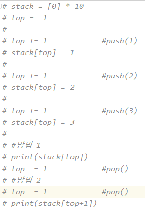
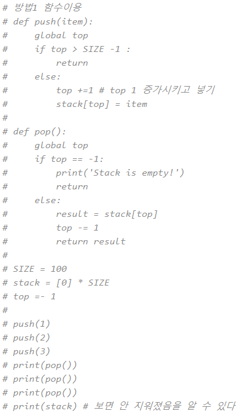
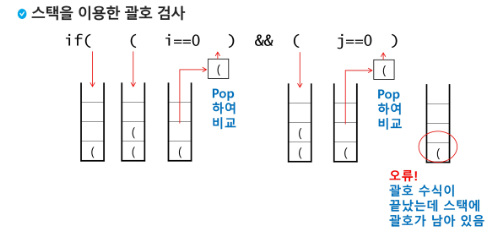
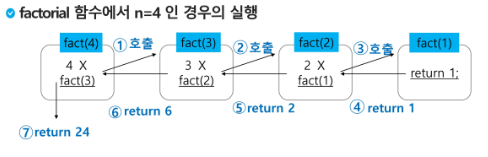
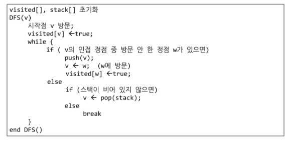

# 0809_0810 TIL

## 잡다한 것

- 파이썬 시간 복잡도
  https://www.ics.uci.edu/~pattis/ICS-33/lectures/complexitypython.txt
  
  [TimeComplexity - Python Wiki](https://wiki.python.org/moin/TimeComplexity)

- 메모리 구조
  code(프로그램) - data(전역) - heap(동적) - stack(지역)   

- for 문이 재귀보다 빠르다, 단 가지치기를 한다면 재귀가 더 빠름(그래서 배움)

- 시험문제(주관식)
  

- 월욜에 DFS(문제풀이로는...) 안 나옴, 이후엔 나올지도?

- 참고) 그래프 안에 트리가 있다, (트리는 방향이 x)
  그래프나 트리 문제는 표현방법을 알아야 한다.(인접 행렬, 인접 리스트)
  그래프는 시작정점을 어디로 하든 상관 x
  
  
  
  인접 행렬 단점: 0이 많아서 낭비가 심함, (연결리스트로 해결 가능하단다...)

- 재귀는 디버깅 하지 말거라~, 날 믿어!!

- 레이저로 막대 썰기 관련 문제
  

- 파이참 새 프로젝트 새로운 위치에서
  
  

- 재귀는 리턴이 빡셈... 차례대로 리턴해서 나오므로 리턴 값도 잘 짜 줘야 됨
  
  이렇게 하기 힘드니깐 global사용한다네요...(이해 더 필요)
  
  추가) 완전 검색으로 할 수 있기도 하지만, 원하는 부분까지 도달한다면 빠져나오도록 할 수 있다. (global을 통해서, 약간의 가지치기 느낌)(flag)

- cf 그래프 경로 문제 전인구!

- 종이 붙이기
  [[swea] 4869. 종이붙이기 / python 파이썬](https://jennnn.tistory.com/15)
  
  notice 고급 타일 참고

---

## Stack 1(스택 1)

### 스택

- 스택의 특성(밑줄 중요!!)(설명 가능해야 함)
  

- 스택의 구현
  
  
  여기서 peek은 꼭대기에 뭐가 있는지 확인하는 정도의 연산이다.(pop과의 차이점.)
  
  `top`이 가장 마지막으로 push된 원소의 인덱스를 가짐  
  
  
  
  
  참고 부분에서의 추가 설명, 위는 함수로 구현(디버깅을 위해 overflow 출력되도록 만든것, 없어도 됨), 아래는 그냥 구현한 것임
  
  
  비어있는데 꺼낼려고 하면 out of range 뜸....(**비어있는 경우 확인 필수!!!**)
  
  
  방법 구현
  
  

- 스택 구현 고려 사항
  

- 스택의 응용1: 괄호검사(이거도 나온답니다.)(단골 문제)
  
  
  위의 스택을 이용한 괄호 검사(중요!!!!, 그림 기억!!)
  
  여는 괄호는 push, 닫는 괄호는 pop을 해준다.
  
  오류 예)
  
  1.수식 끝, 괄호 남음(여는 괄호가 더 많은 경우) => isEmpty() = False
  
  2.닫는 괄호가 여는 괄호보다 더 많이 있어서 닫는 괄호를 만났는데 스택이 비어있는 경우, pop을 우예 할낀데.. 오류발생
  
  3.pop()한 결과가 여는 괄호와 다른 경우(ex. 대괄호로 열었는데 소괄호로 닫는 다던가..)
  
  
  여기서 top괄호를 삭제한다는 것은 pop()하겠다는 말입니다.

- 스택의 응용2 : function call
  
  
  cf) 함수가 다 작동 후 다시 원래 자리로 복귀하기 위한 정보 가짐, 해당함수에 대한 정보가 있는 곳으로 건너뜀(그 위치에 대한 정보를 가지고 있음) 
  
  ~~함수 내의 변수는 다 작동한 후에 사라짐, return으로 받은 것 제외 (내 기억)~~(이것도 스택의 원리이다.) 함수=> 동작하는 시점에서만 그 해당 스택을 차지하고 사용(나중에 덮어써짐)

### 재귀호출

- 재귀호출이란?
  
  - 자기 자신을 호출하여 순환 수행되는 것
  
  - cf) 함수에서 실행해야 하는 작업의 특성에 따라 일반적인 호출방식보다 재귀호출방식을 사용하여 함수를 만들면 프로그램의 크기를 줄이고 간단하게 작성 가능

- 간단한 예
  
  
  
  
  중요! -재귀함수든 서로 다른 함수든 간에 호출 될때마다 메모리 영역이 나눠지고 거기에 각각의 상황에 따라서 값이 저장
  
  스택 느낌쓰~(자기 할 것 다하면 펑 하고 날라감)

- 간단한 예2
  
  
  

### Memoization

- 앞의 예에서 피보나치 수를 구하는 함수를  재귀함수로 구현한 알고리즘은 문제점이 있다.
  
  - 엄청난 중복 호출이 존재!!
    

- 이를 해결하기 위한 Memoization 
  
  
  
  리스트인데 글로벌이 필요할까요? 해보세요..
  
  memo라는 변수를 만들어놔서 그 값을 저장해둠. 그러면 만들어진 것을 바로 사용해서 바로 리턴 가능하게 함(더 이상 아래로 내려가지 않고)
  
  할 때마다 계산하는 것이 아니라 많이 쓰일 것 같으면 미리 계산해서 넣어둠(한번만 계산)

### DP

- DP란?
  
  - 동적 계획 알고리즘은 그리디 알고리즘과 같이 최적화 문제를 해결하는 알고리즘
  
  - 동적 계획 알고리즘은 **먼저 입력 크기가 작은 부분 문제들을 모두 해결한 후에 그 해들을 이용하여 보다 큰 크기의 부분 문제들을 해결**하여, 최종적으로 원래 주어진 입력의 문제를 해결하는 알고리즘

- DP의 구현 방식
  

### DFS(깊이우선탐색)

- 비선형구조인 그래프 구조는 그래프로 표현된 모든 자료를 빠짐없이 검색하는 것이 중요함

- 두 가지 방법
  
  - 깊이 우선 탐색(DFS) <- 얘는 stack에서 다루고
  
  - 너비 우선 탐색(BFS) <- 애는 que에서 다룸

- DFS란?
  
  - 시작 정점의 한 방향으로 갈 수 있는 경로가 있는 곳까지 깊이 탐색해 가다가 더 이상 갈 곳이 없게 되면, 가장 마지막에 만났던 갈림길 간선이 있는 정점으로 되돌아와서 다른 방향의 정점으로 탐색을 계속 반복하여 결국 모든 정점을 방문하는 순회방법
  
  - 가장 마지막에 만났던 갈림길의 정점으로 되돌아가서 다시 깊이 우선 탐색을 반복해야 하므로 후입선출 구조의 스택 사용
  
  - 스택을 사용해서 탐색하는 방법이라고 하면 x, 좀 더 똑바로 설명 필요
    
    - 갈 곳이 없으면 지나온 길 중에서 가장 가까운 갈림길로 돌아옴

- DFS 알고리즘
  
  
  스택이 공백이 되었다는 것은 더 이상 갈림길이 없나는 것을 의미 
  
  ~~1차 목표: 빠짐없이, 중복없이 만들기~~
  
  
  
  
  
  
  
  
  
  
  
  
  
  
  
  
  
  
  되돌아감 -> 뒷걸음치다

- 방식1
  

- 방식2
  
