# 0814_0816 TIL

## 잡다한 것

---

## Stack 2 (스택 2)

### 계산기1

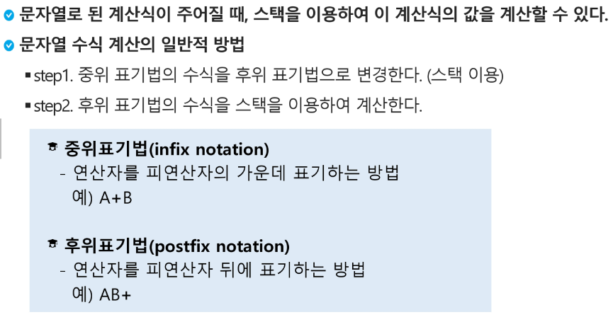

- step 1. 중위표기식의 후위표기식 변환 방법 1
  
  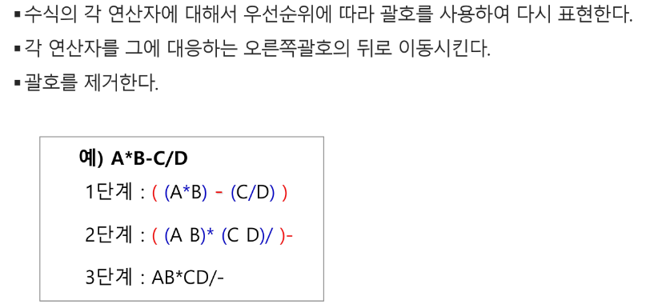
  
  - step1. 중위 표기법에서 후위 표기번으로의 변환 알고리즘(스택 이용) 2
    
    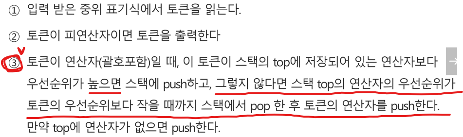
    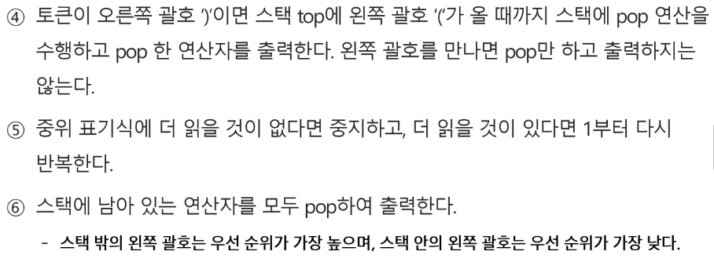

- step2 후위 표기법의 수식을 스택을 이용하여 계산
  
  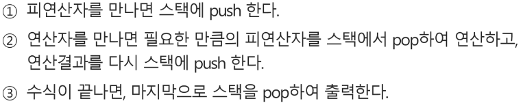
  
  주의 해야될 것: 덧셈이나 곱셈은 pop한 두 피연산자의 순서가 바뀌어도 되지만  뺄셈이나 나눗셈은 순서 신경 써줘야한다.(먼저 뺀 애가 오른쪽으로 가도록!!!!)

- 코드(계산기, 정상적인 수식만 들어온다는 전제로)
  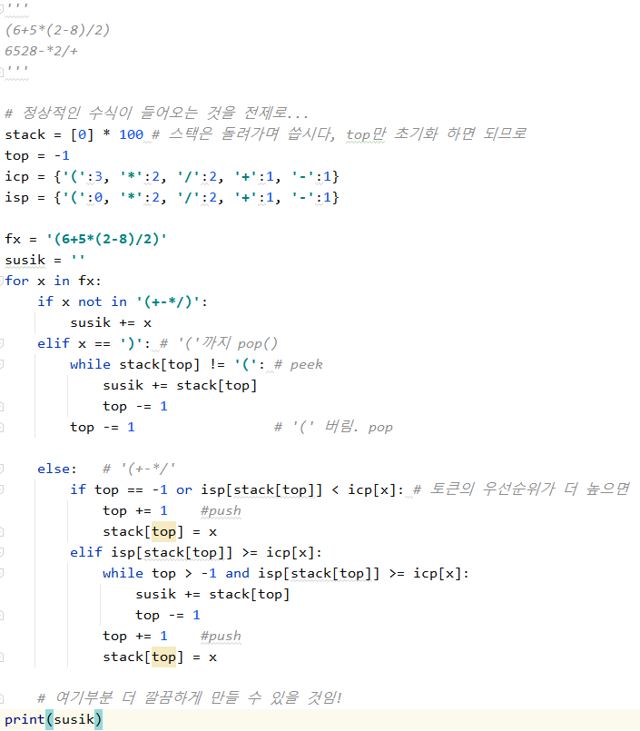
  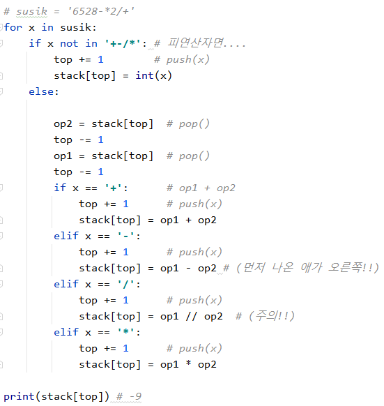
  pop(), append(x)로
  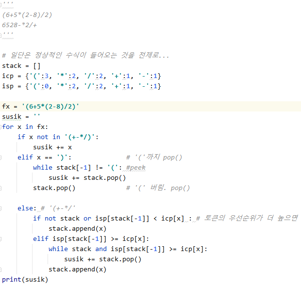
  

### 백트래킹

- 백트래킹이란?
  
  - 해를 찾는 도중에 막히면(즉, 해가 아니면) 되돌아가서 다시 해를 찾아 가는 기법
  
  - 최적화(optimization) 문제와 결정(decision) 문제 해결 가능
    
    - 결정 문제: 문제의 조건을 만족하는 해가 존재하는지의 여부를 'yes' 또는 'no'가 답하는 문제
      
      - 미로 찾기
      
      - n- Queen 문제
      
      - Map coloring
      
      - 부분 집합의 합(Subset Sum) 문제 등

- 예시(미로찾기)
  
  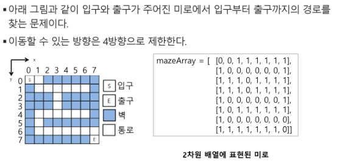
  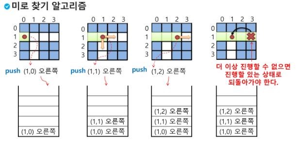
  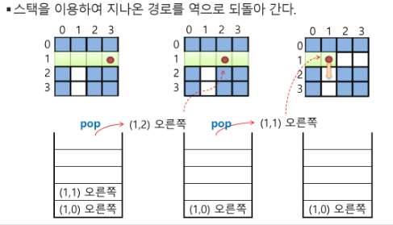
  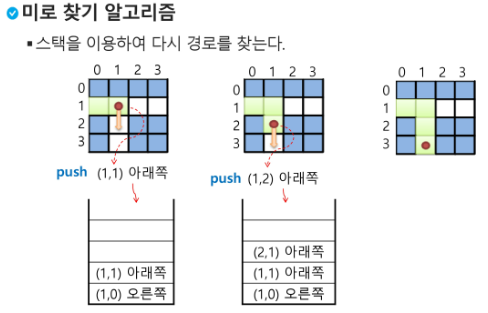

- 백트래킹과 깊이우선탐색과의 차이
  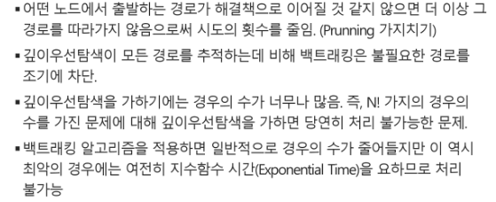
  
  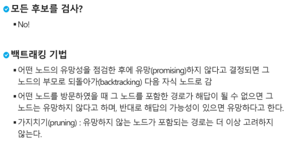
  
  **골라내는 과정이 있고** 그 골라놓은거를 차례대로 선택을 하면 백트래킹(다 하지 않음)
  후보를 고르는 작업이 보이면 백트래킹
  
  ~~놓고 나서 생각하면 dfs. 따져보고 놓으면 백트래킹~~

- 백트래킹 알고리즘
  
  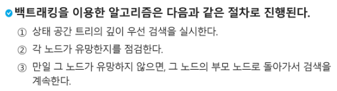
  예측 후보군을 잘 고를 때 단순히 여기에 있느냐 없느냐 혹은 갈 수 있느냐 없느냐를 바로 내 위치에서만 보는 것이 아니라 어떤 조건들을 동원하면 예측 가능(이후의 상황 예측가능하게 해서 가보지 않고(차단) 미리 거를 수 있음), 근데 예측 잘못 설계하면 망함(먼저 기본부터 연습하고 해라!!)
  
  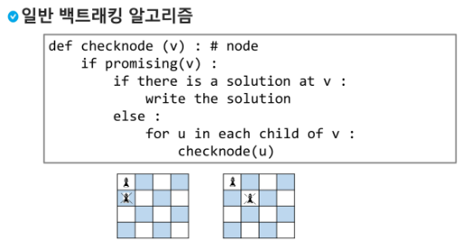
  
  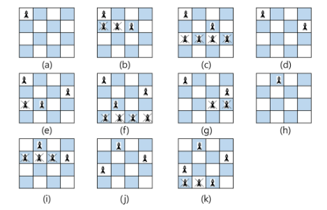
  
  퀸은 8방에 있으면 안됨
  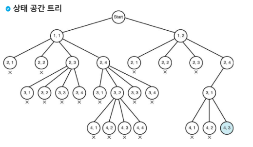
  인덱스 1부터임..(참고)

- 부분집합 구하기
  
  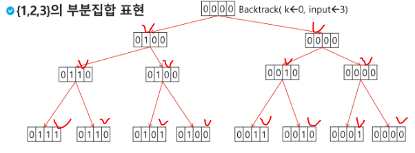
  0 1 2 3

- 순열 구하기(나중에 더 쉬운 방식 알려준답니다!!)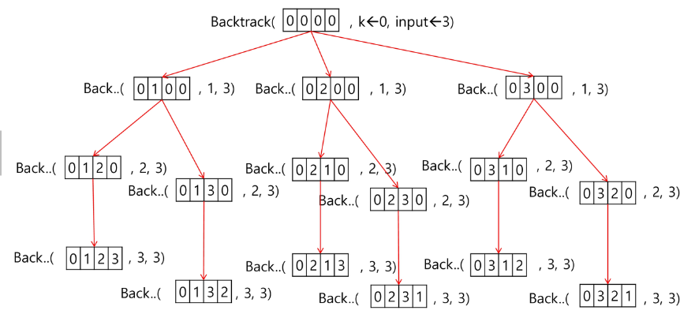

### [참고] 부분집합, 순열

- 들어가기에 앞서 재귀 연습
  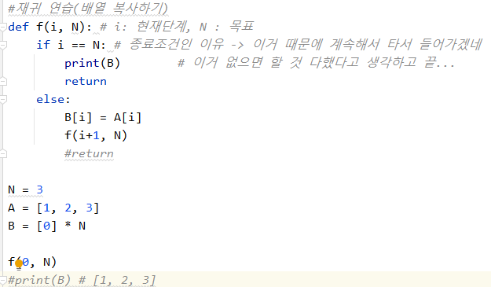

- 부분 집합의 합
  .png)
  
  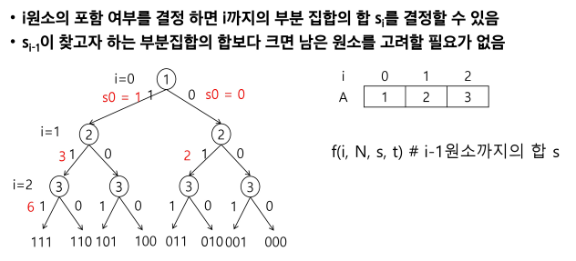
  
  
  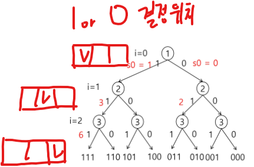
  미로처럼 생각하면 됨, 한 길로 가다가 갈 길 없으면 리턴하고 갈림길에서 다시 타서 들어가고 (재귀함수는 DFS랑 같은 느낌..)
  
  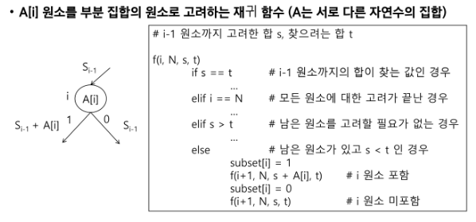
  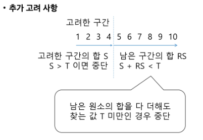
  
  주로 0 1 보단 **1 0**으로 함(그게 더 유리하다랄까?, 가지치기 때 좋을려나?)
  더 이상 가지마!(가지치기) : `return`해주면 됨

- 부분집합 관련 코드
  
  - 부분집합 재귀
    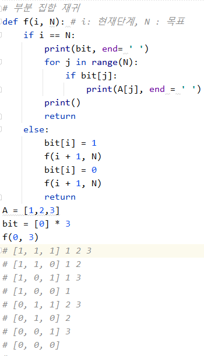
    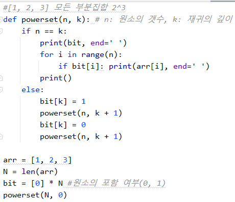
  
  - 부분 집합의 합 재귀
    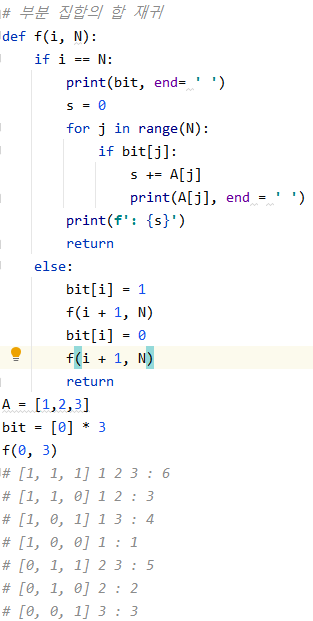
    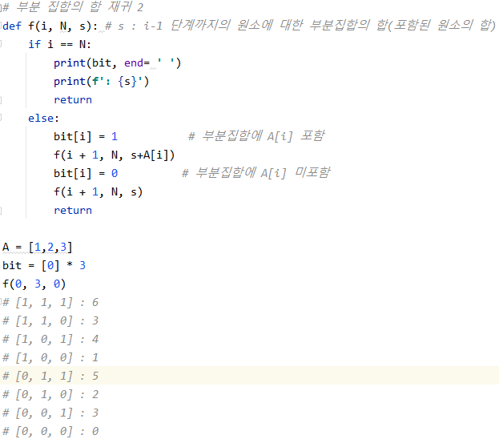
    
    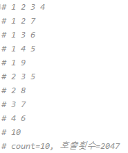
  
  - 부분집합의 합(가지치기)
    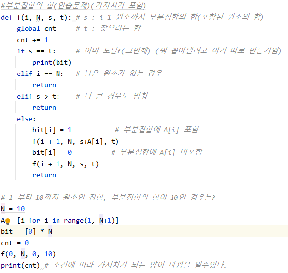
    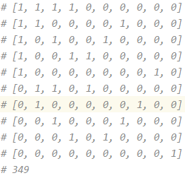
     
     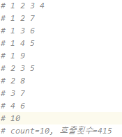

- 순열 (주로 구해야 하는 것의 길이가 변화 x하면 순열)
  .png)
  
  함수 스택 쌓아보면서 test 해보기
  k = 0일때는 인덱스 0인 값만 결정 -> 반복!
  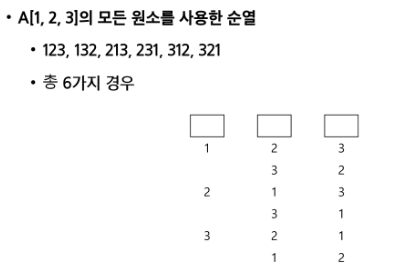
  
  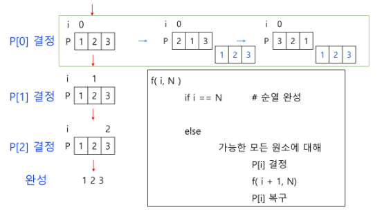
  복구 필수!!
  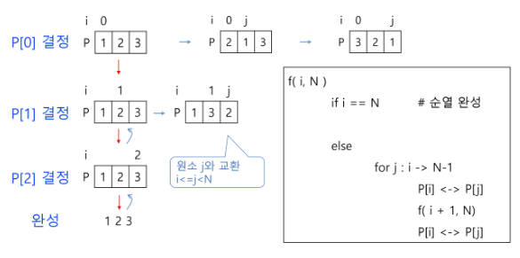

- 순열 코드
  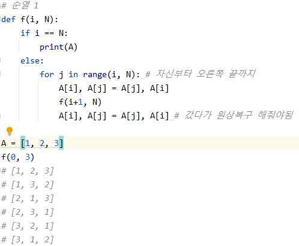
  
  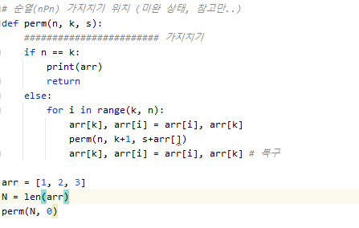

### 분할 정복 알고리즘

- 설계 전략
  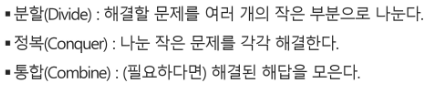
- 분할 정복 예
  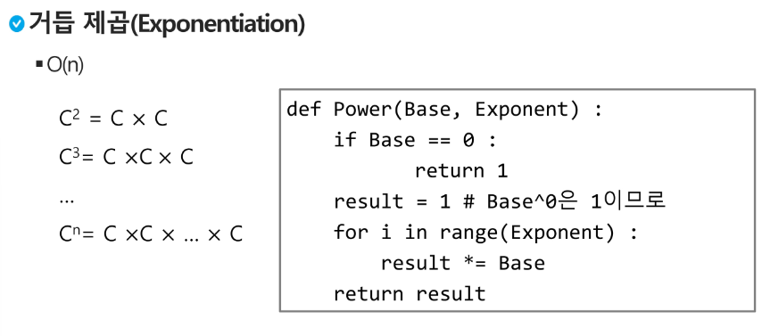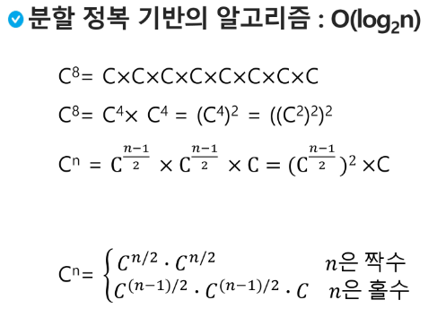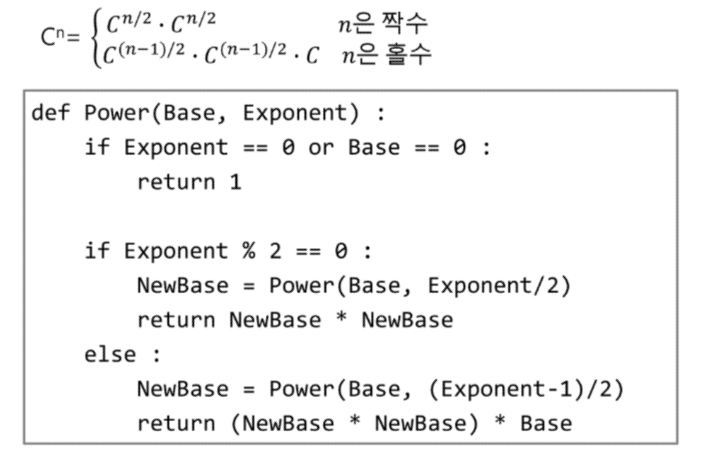
- 대부분의 분할 정복은 범위가 주어진다..
  - 코드
    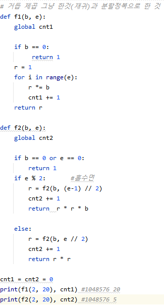
