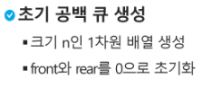
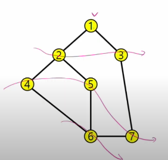

# 0817_0818 TIL

## 잡다한 것

---

## Quene(큐)

- 큐의 특성
  
  - 스택과 마찬가지로 삽입과 삭제의 위치가 제한적인 자료구조
    
    - 큐의 뒤에서는 삽입만 하고, 큐의 앞에서는 삭제만 이루어지는 구조
  
  - 선입선출구조(FIFO)
    
    - 큐에 삽입한 순서대로 원소가 저장되어, 가장 먼저 삽입된 원소는 가장 먼저 삭제 된다.

- 큐의 구조 및 기본연산
  
  
  

- 큐의 연산 과정
  
  
  
  
  두 개의 인덱스를 가진다고 생각(들어온 애, 나간 애의 위치)
  front는 마지막 삭제 위치, rear은 마지막 저장 위치
  
  front와 rear이 만날 때는 두번 있다. (처음과 마지막)

### 선형큐

- 1차원 배열을 이용한 큐
  
  - 큐의 크기 = 배열의 크기
  
  - front: 저장된 첫 번째 원소의 인덱스(마지막 삭제 위치)
  
  - rear: 저장된 마지막 원소의 인덱스

- 상태 표현
  

- 큐의 구현
  
  
  
  
  
  `isFull()`은 그냥 디버깅 용도(생략 가능)
  
  
  
  

- 코드
  
  - front, rear 사용
    
  
  - 메소드 사용
    
  
  - deque 사용
    
    

- 함수 이용
  
  

### 원형 큐

- 선형 큐 이용시의 문제점
  
  
  

- 원형 큐의 구조
  
  
  
  
  이렇게 하지 않으면 공백과 포화 상태 구분 불가

- 원형 큐의 연산 과정
  
  
  
  
  
  6번이 꽉 찬 상태(front 자리는 비어있어야 하므로)

- 원형 큐의 구현
  

- 코드
  

### 우선순위 큐

- 우선순의 큐의 특성
  
  - 우선순위를 가진 항목들을 저장하는 큐
  
  - FIFO 순서가 아니라 우선순위가 높은 순서대로 먼저 나가게 된다.

- 우선 순위 큐의 적용 분야(참고)
  
  - 시뮬레이션 시스템
  
  - 네트워크 트래픽 제어
  
  - 운영체제의 테스크 스케줄링

- 우선 순위 큐의 구현 및 기본연산 

- 배열을 이용한 우선순위 큐
  
  

- 큐의 활용: 버퍼(Buffer)(참고)
  
  

### BFS

- 그래프를 탐색하는 방법에는 크게 2 가지
  
  - 깊이 우선 탐색(DFS)
  
  - 너비 우선 탐색(BFS) 

- 너비우선탐색은 탐색 시작점의 인접한 정점들을 먼저 모두 차례로 방문한 후에, 방문했던 정점을 시작점으로 하여 다시 인접한 정점들을 차례로 방문하는 방식

- 인접한 정점들에 대해 탐색을 한 후, 차례로 다시 너비우선탐색을 진행해야 하므로, 선입선출 형태의 자료구조인 큐를 활용함

- cf) 거리 순 탐색을 할 때 유리

- 거리별로, 가까운 놈은...(힌트)

- 그림
  
  

- BFS 알고리즘(아래껀 몰라도 됨, 더 아래것만 알면 됨)
  (deQ 할 때 방문체크)
  

- 다른 예
  
  
  enQ할 때 방문 체크

  **visited 위치 차이** (이미 처리했어요..느낌, 이미 줄 서있으니 또 세우지 마!)
  주로 위의 방식을 더 위의 방식보다 권함

  **여러 경로로 이어져 있으면 더 빠른 순으로 탐색된다는 특징이 있다.** (잘 생각해보면 됨)

  정점과의 거리와 관련된 방식으로 문제 많이 냄(너무 단순하니 티 안나게 꼬아서 낸다고 함)

  `visited[i] = visited[t] + 1`: 거리 세어주는 느낌(위의 정점 visited값 +1) (위에 오타있음)

  ~~가장 많이 걸리는 시간이나 거리 물어봤을 때 1 빼는 이유: 자기 자신의 땅에서 자기 자신으로 가는 것 고려~~

- 연습문제
  
  
  
  1 부터 시작할 때
  
  2부터 시작할 때
