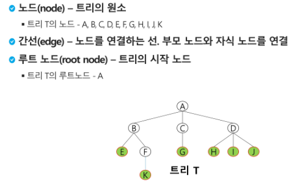

# 0821_0822 TIL

## 잡다한 것

- 참고
  
  

---

## Tree(트리)

### 트리

- 트리의 개념
  
  - **비선형 구조**
  
  - 원소들 간에 1 : n 관계를 가지는 자료구조
  
  - 원소들 간에 계층관계를 가지는 계층형 자료구조
  
  - 상위 원소에서 하위 원소로 내려가면서 확장되는 트리(나무)모양의 구조

- 트리 - 정의
  
  최상위 노드를 루트라고 하는 것 기억하기!!

- 트리 - 용어정리
  
  
  트리의 차수는 자식 노드만의 수임....
  

### 이진트리(트리 중에서 이것만 쓸 것임, 이거 아니면 그래프로 처리할 것이다.)

- 모든 노드들이 2개의 서브트리를 갖는 특별한 형태의 트리

- 각 노드가 자식 노드를 최대한 2개 까지만 가질 수 있는 트리
  
  - 왼쪽 자식 노드
  
  - 오른쪽 자식 노드

- 자식 노드가 2개 이내 이기만 하면 된다!!

- 예
  

- 이진 트리 - 특성
  

- 이진트리 - 종류(기억할 것!, 포화랑 **완전** 이진 트리..)
  
  
  
  
  |
  
  완전이진트리이면 1차원 배열로 하고 완전이진트리가 아니면 인접리스트로 풀 것!!!

- 이진트리 - 순회(앞에서의 탐색을 여기선 그냥 순회라고 부르는 것임)
  
  - 순회란?
    
    - 트리의 노드들을 체계적으로 방문하는 것
    
    - 트리의 각 노드를 중복되지 않게 전부 방문(visit) 하는 것을 말하는데 트리는 비 선형 구조이기 때문에 선현구조에서와 같이 선후 연결 관계를 알 수 없다.
    
    - 따라서 특별한 방법 필요.
  
  - 3가지의 기본적인 순회방법
    
    
    
    - ~~부모 먼저하고 자식을 하든, 자식 먼저하고 부모를 하든 자식 내부에서의 우선순위는 무조건 왼쪽 (자식) 먼저.~~
  
  - 전위 순회
    
    
    - 예(~~DFS 느낌~~)(~~방문체크만 없음~~)
      
    
    - 서브 트리의 루트 부터 탐색 시작한 경우에는 서브트리 내에서만 순회한다. (그 위로 올라가지 않음) (만약 B부터라면 A와 B 사이의 간선이 끊어져있다고 생각해도 됨) (트리는 내려갈려고 만든? 구조이므로 만약 B부터 시작한다면 A위로 올라가지 않는다.)
    
    - 즉, 서브트리의 순회는 서브트리 내에서만 순회하고 끝
  
  - 중위 순회
    
    왼쪽에서 리턴하면 visit
    
    
    
    - 예
      
  
  - 후위 순회
    
    
    - 예
      

- 연습
  
  
  - 전위 순회 : **A** B D E C F G
  
  - 중위 순회 : D B E A F C G
  
  - 후위 순회 : D E B F G C **A**

- 중위순회 코드
  

### 이진트리의 표현

- 참고) 완전 이진트리라는 말이 나오면 1차원으로 저장함

- 배열을 이용한 이진 트리의 표현
  
  - 이진 트리에 각 노드 번호를 다음과 같이 부여
  
  - 루트의 번호를 1로 함
  
  - 레벨 n에 있는 노드에 대하여 왼쪽부터 오른쪽으로 2^n 부터 2^n+1 -1까지 번호를 차례로 부여
    

- 노드 번호의 성질(기억!)
  
  i가 음수일 때를 생각하면 버림이라고 생각하면 안됨을 알 수 있다.(그치만 인덱스이니깐 음수 일리가 없어서 버림이라고 생각해도 된다.)

- 배열을 이용한 이진 트리의 표현
  
  
  
  보면 완전이진트리가 아니라서 저장하기 어렵다는 것을 알 수 있다.(즉, 완전이진 일 때만 1차원 배열로 저장!!!!)

### [참고] 이진 트리의 저장

- cf) 정점의 수 = 간선의 수 +1

- 부모 번호를 인덱스로 자식 번호를 저장
  

- 자식 번호를 인덱스로 부모 번호를 저장
  

- 인접리스트로도 구현 가능
  

- 루트 찾기, 조상 찾기
  
  루트만이 유일하게 부모가 없다.

- 연습문제 코드
  
  인접리스트 방식으로
  

### 수식 트리

~~후위 순회로 해야 될 듯~~
연산자 : 잎 노드 제외

- 수식 트리의 순회
  

### 이진 탐색 트리(소개 정도, hard)

- 이진 탐색 트리 - 연산
  
  - 탐색 연산
    
    
    
    - 참고) 모든 트리가 재귀를 사용하진 x, 반복 구조를 사용하여서 빠르게 동작하도록 가능
  
  - 삽입 연산
    

- 이진 탐색 트리 - 성능(참고)
  한 쪽으로 치우치면 성능 떨어지므로 그렇지 않도록 만드는 알고리즘 이용?? 근데 어려워서 이런게 있다 정도로만..

- 이진 탐색 트리 - 연산 연습
  
  - 삭제 연산 
    
    연결리스트 필요!

### [참고] 힙(heap)(오늘의 하이라이트)

완전이진트리 구조임을 알 수 있다.

- 힙 연산 - 삽입
  
  
  우선 마지막 정점의 번호를 알고 있으면 된다.(완전이진트리 유지를 위해)
  
  최대 힙 유지도 해야 됨( ~~부모 > 자식~~) -> 놓고 비교하기(왜냐, 완전이진트리 깨지면 안되므로 넣어두고 판단)(조건 만족 안하면 자리 바꿔주기, 바꾸고 또 그 부모랑도 비교해봐야됨, 바로 종료하면 안됨..) (부모> 자식 일 경우와 부모가 없을 경우까지 계속되어야 한다...)

- 연습문제
  
  

- 힙 연산  - 삭제
  
  
  
  1. 루트 따로 빼놓기! (임시저장 필요) (왜냐하면 내부적으로 정리 필요하므) (루트 위치에 마지막 요소 올릴 것 이므로)
  
  2. 마지막 노드 삭제하고 루트 위치에 올려주기 (하나 삭제한 것이므로 last도 하나 줄)
  
  3. 자식 둘 중에  큰 자식 찾고 그거랑 부모랑 비교하고 바꾸기 
  
  자식이 없거나 부모가 크면 비교 중지(최대 힙)

- 힙 삭제 코드
  

- **이진 탐색 트리는 왼쪽보다 오른쪽 서브트리가 크다는 특징이 있었지만 heap은 부모 자식 간의 관계만 만족하면 끝이다!!**

- import를 이용한 코드
  

- 힙을 이용한 우선순위 큐
  

### 문제풀이(참고)

