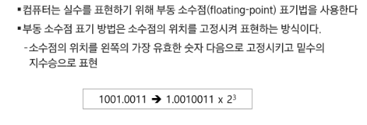

# 0823_0824 TIL

## 잡다한 것

- 클린 코드

- XX까지만 해도 점수를 어느정도 받을 수 있습니다. => 그 구현이 우선 필요하겠구나~

- 뒤에서부터 생각해서 문제를 풀 수 있을까? (방향의 전환 필요) (ex 백만장자)

- 문제에서 주어진 정보 활용하기 -> 기껏 배열의 길이(N)를 줬는데 len(arr) 남발 NO!!

- 꿀팁
  
  
  입력의 앞 뒤에 0을 달아주면 좀 더 쉽게 풀 수 있는 경우가 있다!!

---

## Start

### SW 문제 해결(pass)

### 복잡도 분석

- 복잡도의 점근적 표기
  
  
  
  
  
  
  여기서 점근적 상하한이 어떤 것인지 정도는 인지하기!
  

### 표준 입출력 방법

- Python3 표준입출력
  
  
  
  

- 파일의 내용을 표준 입력으로 읽어오는 방법(**제출 시 삭제 필수!!**)
  

- python 소스 코드
  
  

### 비트 연산

- 비트 연산자
  
  주로 xor 는 특정 비트를 반전, `~`는 모든 비트를 반전 시킬 때 쓰인다.
  
  
  
  cf, 특정 비트가 1인 값 만들기 -> `(1<<5 | 1<<3)`: 5번 비트랑 3번 비트가 1인 값
  즉, 두 비트 이상을 1로 만들고 싶을 때는 각각 만들고 |를 해주면 된다.
  

- 비트 연산
  

- 비트 관련 코드
  

- 이진수 1문제 딕셔너리 안 쓰고 푸는 법
  

- 예
  
  

- 엔디안(Endianness)
  
  
  
  - 엔디안 관련 예
    
    

- 예
  

### 진수

- 컴퓨터에서의 음의 정수 표현 방법
  
  
  1의 보수 안 쓰는 이유: 0과 -0이 동시에 존재하는 경우가 생기므로
  
  2의 보수는 -2 + 6 해보면 0000 0000 0000 0100 이렇게 나온다(이게 바로 계산이 되는 신기한 2의 보수) , 6 - 2 => 6 + ( -2)
  
  3bits 범위 => (-2^2)  ~ (2^2 -1) 

### 실수

- 실수의 표현
  
  
  실수를 저장하면 오차가 생길 수 있다!!!!
  
  금융권, 방산(미사일) 같은 곳에서 이 값들 사이의 오차를 어떻게 해결할 것인가??
  
  if a == b(오차 생겨도 맞다고 할 수 있음)=> if abs(c-d) < 10^-6, 이렇게 하면 좀 더 정확!!
  

- 실수의 표현
  
  
  
  
  
  
  여기서 2의 보수법이 아닌 익세스 표현법을 이용한다.
  
  
  
  
  소수점 위의 자리수가 높다면 소수점 아래의 숫자가 저장될 수 있는 공간이 줄어들어서 원하는 소수점자리까지의 값 보장이 안 될 수 있다.

- 연습문제 3
  
  
  연속되는 0과 1의 갯수를 세아리고 그 중 가장 작은 것을 배율로 정해서 구해주고 그것과 배율을 비교하면 쉽게 된다.
