# 0829_TIL

## 잡다한 것

---

## 컴퓨팅 사고력

### 프로그래밍과 논리/수학

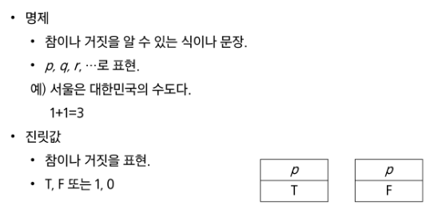
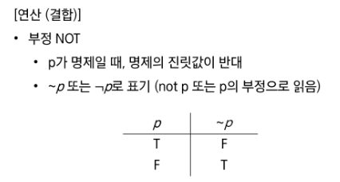
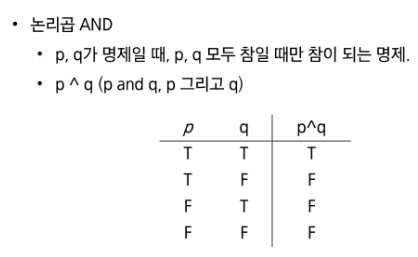
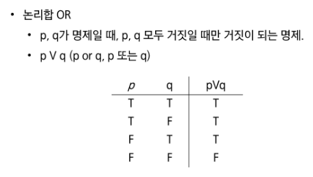
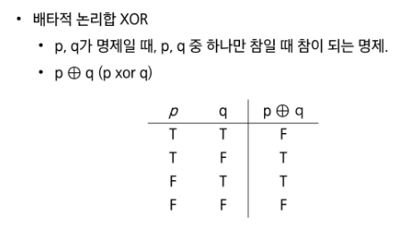
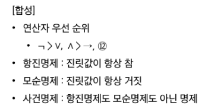
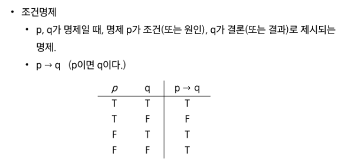
조건 명제는 기억!!
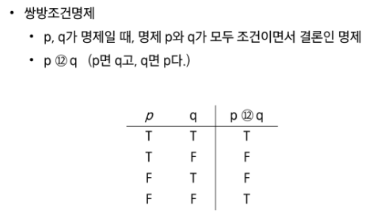
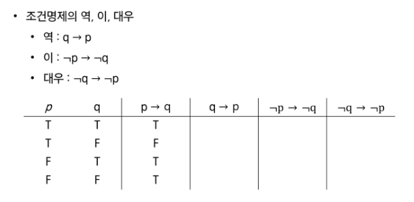

### 논리와 증명(참고)

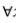(모든), 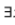(어떤)

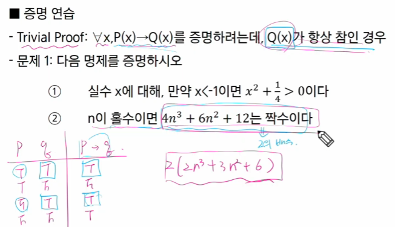
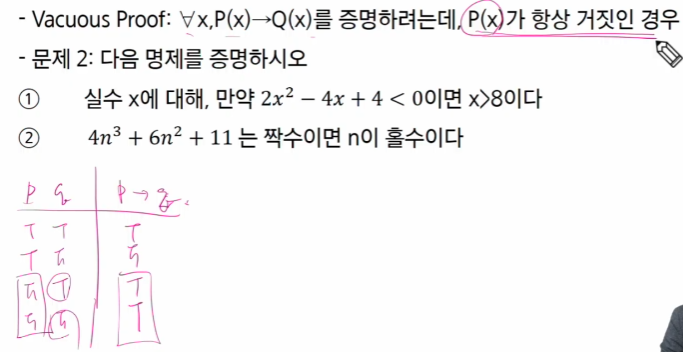

### 수와 표현

- log 사용하는 이유: 매우 큰 값을 작게 표현하기 가능하기 때문

- 로그 여기 부분 서로 바꿀 수 있음
  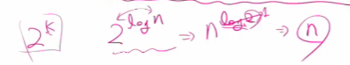

### 집합과 조합론

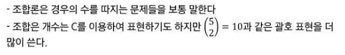

### 기초 수식(여기 앞 번호로 test)

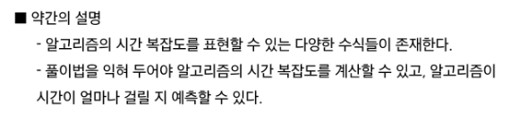
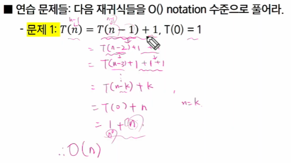

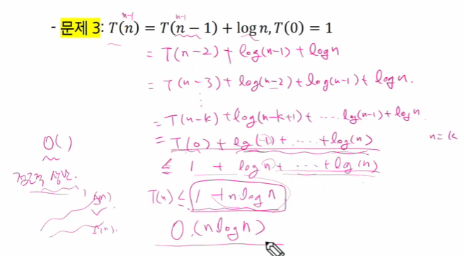
빅오는 점근적 상한 임을 이용해서 푼 것임(위의 문제는)

힌트만 줌
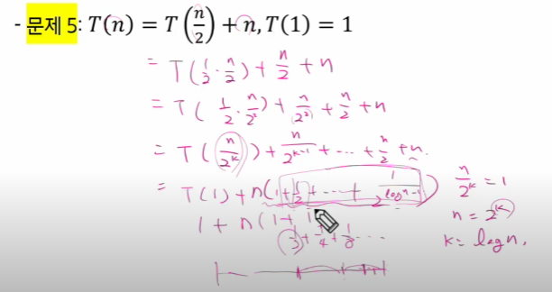
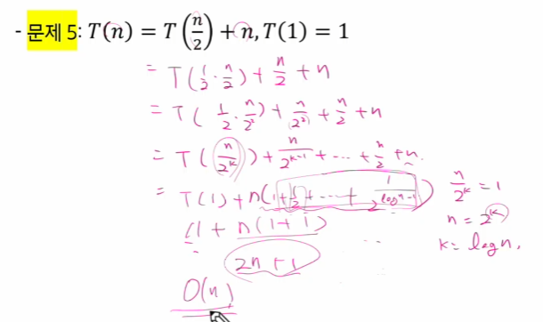

여기서 T는 호출 횟수이다.

문제 6번 답: O(nlogn)
문제 7번 답: 
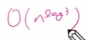

### 재귀

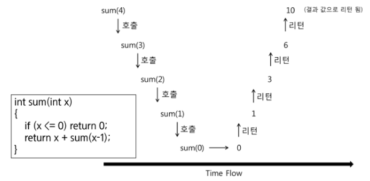

### 동적 프로그래밍
