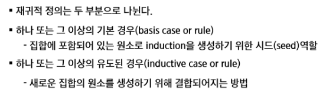
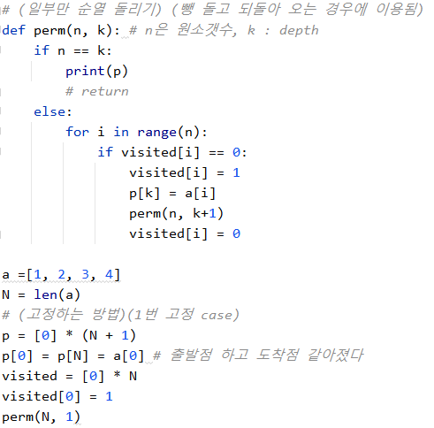
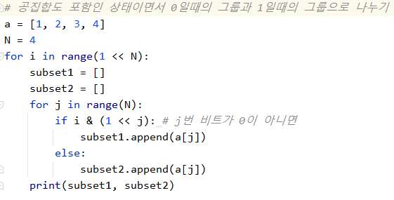
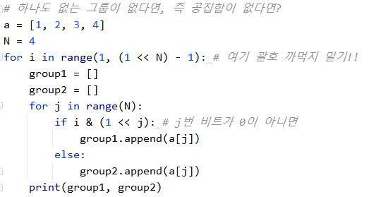

# 0830_0831 TIL

## 잡다한 것

- 팩도리얼 매우 큰 수라서 파스칼의 삼각형 이용
- ctrl + alt + L 하면 띄워쓰기나 그런 것들 다 해줌
- shift로 위치 하고 shift + alt + 방향키로 위치 옮기기

---

## 완전검색/ 그리디

### 반복(Iteration)과 재귀(Recursion)

- 반복과 재귀는 유사한 작업을 수행 가능

- 반복은 수행하는 작업이 완료될 때 까지 계속 반복
  
  - 루프(for, while 구조)

- 재귀는 주어진 문제의 해를 구하기 위해 동일하면서 더 작은 문제의 해를 이용하는 방법
  
  - 하나의 큰 문제를 해결할 수 있는(해결하기 쉬운)더 작은 문제로 쪼개고 결과들을 결합
  
  - 재귀 함수로 구현

- 재귀적 알고리즘
  
  

- 재귀 함수
  
  
  - 예
    
    공용으로 자리 사용 x!!!

- 반복 또는 재귀?
  

- 반복과 재귀의 비교
  

- 재귀 연습 코드
  

- 연습문제
  

### 완전검색기법

- 고지식한 방법(brute - force)
  
  
  
  
  어떤 입력을 받을 때 한 칸 더 큰 배열을 준비해서 받고 뒤에다가 내가 찾는 key 값을 붙여놓으면 좋은점: while의 조건에 i < N and 조건을 더 안 추가해도 됨(연산량 줄음), (무조건 key는 만나도록 해서)

- 완전 검색으로 시작하라
  
  
  

요즘엔 문제가 순열에서의 부분집합이나, 부분집합에서의 순열 이런 식으로 섷어서 나온단다...

### 순열

- 순열 생성 방법
  
  
  
  

- 순열 순서대로
  
  
  

- 그림
  

- nPr 보단 nPn이 많이 나옴

- 순열 관련 코드
  

### 부분집합

- 부분 집합 생성 방법
  
  
  

- 부분집합 관련 코드
  
  
  
  
  

### 조합

예를 들어 4C2 = 3C2 +3C1을 설명하자면,  포함 될 때는 나머지 선택지 3C1, 포함 안 될 때는 나머지 선택지 3C2를 택해야 하므로

nC0 : 하나도 안 붙이는 것도 하나의 방법이다.

    n 보다 r이 크면 리턴
    거꾸로 하면 유리한 이유 - ~~visited를 안해줘도 된다.(용수 피셜, 틀렸음.. 바보)~~ , 인덱스 계산 편하므로(강사 피셜)

    

    

- for문을 이용한 조합
  
  
  아래는 중복까지 포함
  
  
  

### 탐욕 알고리즘

- 동작 과정
  

- Knapsack 문제 유형
  
  
  위는 그리디 불가 
  
  
  
  이건 그리디 가능

### 활동 선택 문제

- 탐욕 알고리즘의 필수 요소
  
  
  - 탐욕 기법과 동적 계획법의 비교
    

### Baby -jin

- 전자카트 가지치기 part
  
- 최소합 part
  
- 최대상금
  
