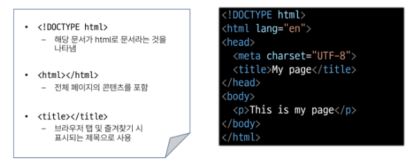
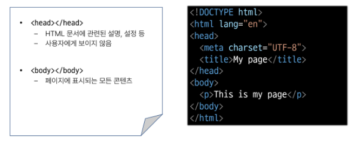

# 0904 TIL

## 잡다한 것

- F12 : DevTools

- ! 하고 Tab

- Alt + B : 실행

- 찾아주기 기능
  

- mdn
  

- Alt + Shift + 아래키 : 복사

- 참고
  

- `li * 3`: li 3개 생성 

---

## Fundamentals of HTML and CSS

### 웹 소개

- Web Page 구성 요소
  
  

### 웹 구조화

#### HTML

- HTML(Hyper Text Markup Language)
  
  - 웹 페이지의 의미와 **구조**를 정의하는 언어

- Hypertext
  
  - 웹 페이지를 다른 페이지로 연결하는 링크
  
  - 참고를 통해 사용자가 한 문서에서 다른 문서로 즉시 접근할 수 있는 텍스트

- Markup Language
  
  - 태그 등을 이용하여 문서나 데이터의 구조를 명시하는 언어
    
    - ex) HTML, Markdown

#### HTML의 구조

- HTML 구조
  
  
  p (paragraphs): 단락

- HTML Element(요소)
  

- HTML Attributes(속성)
  

#### 텍스트 구조

- HTML Text structure
  
  - HTML의 주요 목적 중 하나는 **텍스트 구조와 의미**를 제공하는 것

- HTML
  
  - 웹 페이지의 **의미**와 구조를 정의하는 언어
    
    - 예
      
      

- 대표적인 HTML Text structure
  
  
  - 예
    

### 웹 스타일링

#### CSS

- CSS(Cascading Style Sheet)
  
  - 웹 페이지의 **디자인**과 **레이아웃**을 구성하는 언어

- CSS 구문
  
  
  
  이렇게 열고 닫는 중괄호를 많이 이용함
  `;`는 한 행의 끝을 의미
  
  여기서 선언(**;**)은 필수!!!!
  서로 영향을 주는 것이라면 속성의 순서도 중요하다!!
  
  선택자와 같은 용어도 기억하기!!

- CSS 적용 방법
  
  1. 인라인 스타일(우선순위 높아서 거의 안 씀)
     
     한 줄로 쭉 펴서 작성해야 됨.
     문서 지저분해짐..
     우리가 HTML을 보는 이유는 문서의 구조와 의미를 보기 위함인데 이게 있으면....
  
  2. 내부 스타일 시트
     
3. 외부 스타일 시트
   
   
   link를 통해서 가져옴
   
   이 중 3번째를 가장 권장하고 가장 권장하지 않는 방식은 1번이다. 
   수업에선 2번째를 이용할 것임 (실제론 3번을 많이 씀)

#### CSS 선택자

- CSS Selectors
  
  - HTML 요소를 선택하여 스타일을 적용할 수 있도록 하는 선택자

- CSS Selectors 종류
  

- CSS Selectors 특징
  
  거의 사용 x
  
  id는 유일한 것에 이용, 그리고 javascript가 씀
  
  클래스 선택자를 가장 많이 이용
  
  
  
  - 예시
    
    

#### 우선순위

- Specificity (우선순위)
  
  - 동일한 요소에 적용 가능한 같은 스타일을 두 가지 이상 작성 했을 때 어떤 규칙이 적용 되는지 결정하는 것

- CSS (Cascading Style Sheet)
  
  - 웹 페이지의 디자인과 레이아웃을 구성하는 언어

- Cascade
  
  - 동일한 우선순위가 같은 규칙이 적용될 때 CSS에서 **마지막에 나오는 규칙**이 사용됨

- 아래부터 다시보기

- 우선순위가 높은 순
  
  inline 잘 안 쓰는 이유: 우선순위가 너무 높아서
  이런 우선순위 다 신경 쓰기 hard: class 선택자만 거의 이용해서 그것만 신경쓰면 됨

- !important
  
  - 다른 우선순위 규칙보다 우선하여 적용하는 키워드
  
  - Cascade의 구조를 무시하고 강제로 스타일을 적용하는 방식이므로 사용을 **권장x**

### CSS 상속

- 예
  
  

### HTML 관련 사항

