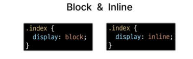

# 0905 TIL

## 잡다한 것

- css 게임

- span 찾아보기(그냥 인라인화 시키기 위한건가?)

- 바로 바꾸기 가능
  
  먼저 여기서 테스트 해보고 옮기는 것도 하나의 방법(단, 여기선  새로고침하면 초기화 됨)

- 인라인 정렬 하는 법: 주로 박스를 감싸고 있는 부모한테 정렬 값(정렬 어떻게 할지)을 준다.

- 참고
  

- 참고
  

- img는 인라인인데 weight 랑 height 적용 됨

---

## CSS Layout

### CSS Box Model

- 모든 HTML 요소를 사각형 박스로 표현하는 개념

#### 구성요소(중요)

- CSS Box Model
  **내용(content)**, **안쪽 여백(padding)**, **테두리(border)**, **외부 간격(margin)** 으로 구성되는 개념
  
  상우하좌(시계방향)
  
  top, right, bottom, left 이거 이름 기억하기

- width & height 속성
  

- box - sizing 속성
  

#### 박스 타입

inline: 자기 영역만큼만, 욕심 x, 그래서 다음요소가 오른쪽에 
block은 다 차지 하므로 아래로 내려가는 느낌(다음요소가 오른쪽에 올 자리가 없어서)
이 차이로 인해 쌓이는 방향이 결정되는 것임

일반적으로 CSS를 아무것도 적용하지 않고 HTML만 쓸 땐 기본적으로 표시한 부분부터 시작

- block 타입 특징
  
  div도??
  이래서 width를 자주 설정해주는구나.. 

- inline 타입 특징
  
  
  컨텐츠 크기에 따라 결정되므로 (빨간줄) 사용 불가
  **패딩, 마진, 보더: 좌우는 되고 상하는 안됨**

블럭이냐 인라인이냐에 따라서 수평 정렬 주는 방식이 다름
블럭: margin으로, 인라인: text- align 으로 함 (달라질 수도 있음)

#### 기타 display 속성

- inline - block
  

- none
  

### CSS Layout Position

- CSS Layout
  
  - 각 요소의 **위치**와 **크기**를 조정하여 웹 페이지의 디자인을 결정하는 것
    
    - Display, Position, Float, Flexbox 등 

#### CSS Position

- 요소를 Normal Flow에서 **제거하여** 다른 위치로 배치하는 것
  
  - 다른 요소 위에 올리기, 화면의 특정 위치에 고정시키기 등

- position 이동 방향
  

- position 유형
  
  
  ~~좌측 상단을 기준으로~~

- Position 유형별 특징(중)
  
  relative는 자기가 차지하고 있던 공간 버리지 않음!!
  absolute는 문서에서 요소가 차지하는 공간이 없어지므로 다른 요소에게 영향을 미침
  
  요소를 Normal Flow에서 제거 -> 집 버리겠다는 의미

- z - index
  
  - 요소가 겹쳤을 때 어떤 요소 순으로 위에 나타낼 지 결정

- 특징
  
  아예 큰 값(9999)를 둬서 예외 상황을 없앨려고 하기도 함
  반대로 아예 낮게 -9999도 있음
  실제로 완전 맨 위에 있어야 된다, 완전 맨 아래에 있어야 한다할때 씀
  이렇게 겹치는 것은 잘 안 만듬

### CSS Layout Flexbox(중요!!)

- CSS Flexbox
  
  - 요소를 행과 열 형태로 배치하는 1차원 레이아웃 방식
    
    - '공간 배열' & '정렬'
    
    - **선**(1차원)을 기준으로 움직인다.

#### 구성요소

- Flexbox 기본 사항
  
  Flex box의 주체는 부모!!(Flex Container라고 함)
  그리고 움직이는 자식요소들을 Flex item이라고 함
  아무런 방향을 결정하지 않으면 main axis은 수평축이 된다.

- Flexbox 기본 사항
  
  메인 축만 알면 교차 축을 알 수 있으므로 메인 축만!
  메인 축만 기억하라!
  
  
  1차 자식까지만 영향을 끼침
  flex 안에 flex가 있을 수 있다.
  

#### 레이아웃 구성

content면 여러 행

- Flexbox 속성
  

- 목적에 따른 분류
  

- 속성명 TIP
  

이거 test

### 위의 것 정리

### 참고

마진 상쇄

