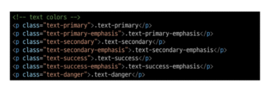

# 0906 TIL

## 잡다한 것

- bootstrap 문서에서 검색으로 찾아서 쓰기

- Grid cards 많이 씀

- form control, pagination

- 링크태그: href, 이미지태그:src

- 오해하지 말 것: bootstrap을 쓴다고 해서 100% bootstrap을 쓸 필요는 없다.

- 비활성화: Disabled

- bootstrap 연습법: 코드를 그대로 복사해나가면서 출력화면을 보고 클래스를 다른 것으로 바꿔보면서 따라가라

- card 많이 쓰인다.

---

## Fundamentals or Bootstrap

### Bootstrap

#### 개요

- Bootstrap
  
  - CSS 프론트엔드 프레임워크(Toolkit)
  
  - 미리 만들어진 다양한 디자인 요소들을 제공하여 웹 사이트를 빠르고 쉽게 개발할 수 있도록 함
  
  - 사용해보면 오히려 스타일이 줄어든 것처럼 보인다.(추가보단 덜어낸 느낌) (시작점을 맞춰줌) -> 브라우저마다 기본적으로 스타일이 적용되는 것이 달라서 브라우저마다 따로 맞춰줘야하는데 이를 방지하기 위함(동일한 시작점에서 시작하자) 
  
  - 참고: 초기화 해주는 파일(bootstrap-reboot.css)(다운 받은 것 중에 있음)
    bootstrap.css: 통합본

- Bootstrap 기본 사용법
  

- Bootstrap에서 클래스 이름으로 Spacing을 표현하는 방법
  
  

- 브라우저의 기본 폰트 size: 16px

- Bootstrap에는 특정한 규칙이 있는 클래스 이름으로 이미 스타일 및 레이아웃이 작성되어 있다.

#### Typography

- 제목, 본문 텍스트, 목록 등

- Display headings
  
  

- Inline text elements
  

- Lists
  

#### Colors

- Bootstrap Color system
  
  - Bootstrap이 지정하고 제공하는 색상 시스템

- Colors
  

- Text colors
  

- Background colors
  

#### Component(이거 때문에 bootstrap 쓴다고 해도 과언이 아님)

- Bootstrap Component
  
  - Bootstrap에서 제공하는 UI 관련 요소
    
    - 버튼, 네비게이션 바, 카드, 촘, 드롭다운 등

- 이점
  
  - 일관된 디자인을 제공하여 웹 사이트의 구성 요소를 구축하는 데 유용하게 활용

### Semantic Web

#### 개요

- Semantic Web
  
  - 웹 데이터를 의미론적으로 구조화된 형태로 표현하는 방식
  
  - div가 정말 많이 쓰이는데, 그냥 div로만 만들면 코드로만 봤을 때 구체적으로 어떤 의미를 가지고 있는지 알기 hard
  
  - 기능적으로 업데이트 되는 것이 아닌 의미만 부여
    
    

#### Semantic in HTML

- HTML Sematic Element
  
  - 기본적인 모양과 기능 이외에 의미를 가지는 HTML 요소
    
    - **검색엔진** 및 개발자가 웹 페이지 콘텐츠를 이해하기 쉽도록
    - 검색엔진이 검색할 때 빠르게 쫙 읽고 구조화 시킴(구조를 파악하고 더 출력해주기도 함(서브))(div로 되어있으면 파악 hard)(심지어 검색엔진 최적화라고 해서 검색엔진 점수가 높아져서 상위페이지에 뜰 확률이 높아짐)
  
  - div에 의미 부여하기위해 노력
  
  - div와 같은 기능을 하지만 의미를 가지는 다른 태그들을 만들어냄
  
  - semantic element
    
    의미는 똑같지만 이해하기 쉽도록 이름 설정
  
  - 예
    

#### Semantic in CSS

- OOCSS(Object Oriented CSS)
  
  - 객체 지향적 접근법을 적용하여 CSS를 구성하는 **방법론**
  - 규칙이 아니라 이렇게 해보자 느낌

- CSS 방법론
  
  - CSS를 효율적이고 유지 보수가 용이하게 작성하기 위한 일련의 가이드라인

- OOCSS 기본 원칙
  
  1. **구조와 스킨을 분리**
     
     - 구조와 스킨을 분리함으로써 재사용 가능성을 높임
     
     - 모든 버튼의 공통 구조를 정의 + 각각의 스킨(배경색과 폰트 색상)을 정의
  
  2. **컨테이너와 콘텐츠를 분리**
     

### 참고(책임과 역할)

