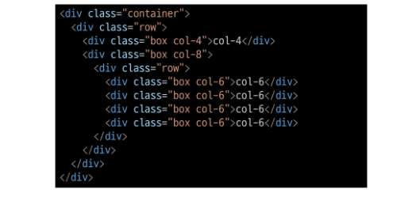

# 0907_TIL

## 잡다한 것

- 처음 클론코딩 연습할 때는 인스타그램(웹 연습은 클론코딩)

- float
  
  신문처럼 요소(이미지)를 감싸는 레이아웃을 만들고 싶었다.
  
  이 요소를 마치 부동체 처럼 띄우자, 띄우면 이 인라인 요소들이 감쌀 것이다.(본래의 목적)(띄우는 느낌!!)
  
  참고: 더 다양하게 사용 가능하겠는데? (가능하지만)그냥 본래의 목적으로만 이용되는 경우 many
  
  레거시 카테고리로 들어감(화석)

- 참고
  

- Emmet Cheat sheet 찾아보기
  

---

## Bootstrap Grid system

### Bootstrap Grid system

#### 개요

- Bootstrap Grid system
  
  - 웹 페이지의 레이아웃을 조정하는 데 사용되는 **12개의 컬럼**으로 구성된 시스템
  
  - 하필 12? 약수가 많아서

- Grid system 목적
  
  - 반응형 디자인을 지원해 웹 페이지를 모바일, 태블릿, 데스크탑 등 다양한 기기에서 적절하게 표시할 수 있도록 도움

#### Grid system 클래스와 기본 구조

- Grid system 기본 요소
  
  
  
  
  Grid 안에 Grid도 가능
  
  한 행당 12Column 고정
  
  12칸 다 차지하면 다음 행으로 넘어감

- 예
  
  
  
  
  
  
  

- Gutters
  
  - Gutter를 적용 안했을 때의 기본 형태: 기본적으로 좌우로는 패딩이 들어가 있어서 여백이 조금 있고, 상하로는 딱 붙어있음

  

- x축에 gutter을 주게 되면 column간의  영역이 조금씩 각자의 너비가 줄어들 수 밖에 없다. (x축의 gutter은 패딩)

- 왜 column이 줄어들면서까지 x축은 padding으로 하는 이유: 마진으로 둔다면 부모 행의 자체가 row 밖으로 나가거나 전체 레이아웃의 너비를 깨트릴 수 있어서(전체에서의 행은 유지를 해야한다!)(하나의 컨테이너 안의  정해진 너비 안에서 움직여야 되는데 마진을 준다면 행 자체의 길이가 길어진다.ㅜㅜ)

- y축은 no problem

- 아래 예를 보면 gutter에 따라 column의 너비 차이가 있음을 알 수 있다.

- 예
  
  

### Grid system for responsive web

#### 개요

- Responsive Web Design
  
  - 디바이스 종류나 화면 크기에 상관없이, 어디서든 일관된 레이아웃 및 사용자 경험을 제공하는 디자인 기술
    

#### Grid system Breakpoints

- 웹 페이지를 다양한 화면 크기에서 적절하게 배치하기 위한 분기점
  
  - 화면**너비**에 따라 6개의 분기점 제공(xs, sm, md, lg, xl, xxl)
    
  - 값 **이상**으로 영향을 끼침 !

- Grid System은 화면 크기에 따라 12개의 칸을 각 요소에 나누어 주는 것

### 참고

옛날 기술이라고 무시 No(다 필요함)

- Grid cards
  
  
  너무 많이 쓰여서 따로 있음
  
  칸 수를 나눠주는 개념이 아니라 주도권이 row에게 있음

    
