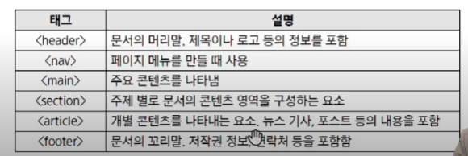

# 0908_ TIL

## 잡다한 것

- div 보단 시멘틱 태그를 이용!!

- 지디웹

- 시멘틱 태그
  
  - 개념: 의미를 부여
    
    - 누굴 위한 의미?
      
      - 개발자 + **검색 엔진** (색인화(목차처럼 만듬))
      
      - SEO
  
  - 종류: header nav

- 참고: SEO checker(절대적인 점수는 아님..)

- 자주 사용하는 시맨틱 태그
  

            

---

## 반응형 웹사이트 구현

- 반응형 웹을 만드는 목적: 
  
  - 여러 디바이스에 여러가지 크기의 화면에서 하나의 페이지를 잘 보여주기 위해
  
  - 내 서비스가 휴대폰과 홈페이지 둘 다 가능하게 하고 싶은데 따로 다 만들기는 좀...

- 진행 내용
  
  - 파일 생성
  
  - 전체 구조 만들기
  
  - 구글 폰트 추가하기
  
  - 네비게이션 바 추가하기

- 전체 구조 만들기
  
  - 포트폴리오 사이트를 만든다 가정(-> 시맨틱)
    
    - 메뉴(Navbar)
    
    - 메인 콘텐츠 -> main
    
    - 자기소개 -> section, article
    
    - 나의 기술 스택 소개 -> section, article
    
    - 진행한 프로젝트
    
    - 연락처 남기기
    
    - 꼬리말(footer)
