# 0912_TIL

## 정리(내가.)

- 참고: 공용문서 - Python - Python 가상환경 설정

- 참고: gitignore(첫 add 전)

- 가상환경 만들기
  
  - `python -m venv venv`

- 활성화 하기
  
  - `source venv/Scripts/activate`
  
  - 비활성화: deactivate(bash를 끄면 자동으로 꺼져서 쓸 일 별로 x)

- Django 설치
  
  - `pip install Django`

- 패키지 목록 공유(패키지 추가 될 때마다 진행!)
  
  - 공유파일 생성
    
    - `pip freeze > requirements.txt`
  
  - 파일을 통해 패키지 받는법은?
    
    - `pip install -r requirements.txt`

- Django 프로젝트 생성
  
  - `django-admin startproject firstpjt .`
    (여기서 뒤에 `.` 필수)

- Django 서버 실행
  
  - `python manage.py runserver`

- 앱 생성
  
  - `python manage.py startapp articles`
  
  - 참고: 프로젝트를 만들때는 manage.py가 없어서 이름이 좀 달랐는데..manage.py가  있는 이후 부터는 대부분이 해당 형식처럼임..  

- 앱 등록
  
  - settings.py의 INSTALLED_APPS 에 추가시켜주기
    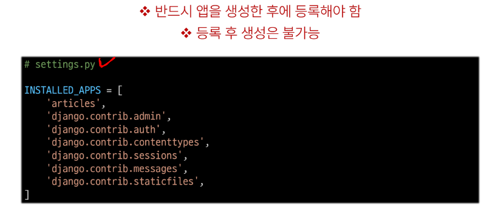

- 데이터 흐름에 따른 코드 작성
  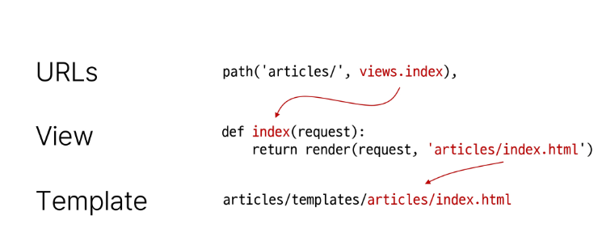

---

## 잡다한 것

- vscode에서 x는 끄는게 아니고 닫는 것이고 휴지통을 누르는 것이 끄는 것이다

- 깨끗하게 하 : Ctrl + L

- 끌 때 ctrl + c로 하고 난 뒤에 vscode 나갈 것(아니면 남아있음, 서버가 켜져있어서 작업관리자로 강제로 꺼줘야 한다.)

---

## Django Intro & Design Pattern

### Django and Framework

#### Framework

- 웹 애플리케이션을 빠르게 개발할 수 있도록 도와주는 도구
  (개발에 필요한 기본 구조, 규칙, 라이브러리 등을 제공)

#### Django framework

- 파이썬 기반의 대표적인 웹 프레임워크

#### 클라이언트와 서버

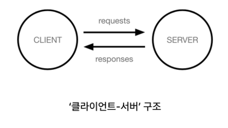

- 클라이언트(Client)
  
  - 서비스를 요청하는 주체
    (웹 사용자의 인터넷이 연결된 장치, 웹 브라우저)

- 서버(Server)
  
  - 클라이언트의 요청에 응답하는 주체
    (웹 페이지, 앱을 저장하는 컴퓨터)

- 우리가 웹 페이지를 보게 되는 과정
  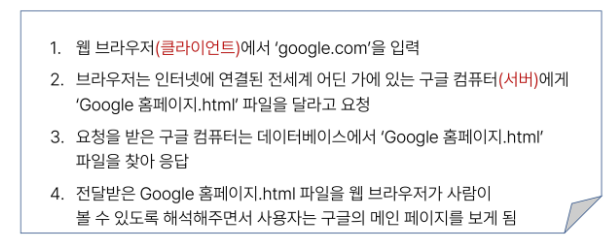

- Django를 사용해서 서버를 구현할 것이다.

#### Django 프로젝트 및 가상환경

- 가상 환경
  
  - Python 애플리케이션과 그에 따른 패키지들을 **격리**하여 관리할 수 있는 **독립적인** 실행 환경

- 참고
  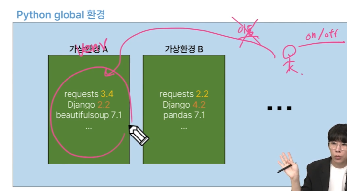여기서 파란색 부분이 글로벌.. (이동보단 on/off 개념), 그래서 하나의 터미널에선 하나의 환경만 켤 수 있다.

- 가상환경 venv 생성
  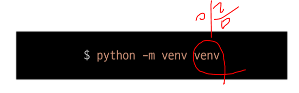
  근데 이름 특이하게 안하고 venv로 해야 욕 안 먹음

- 가상환경 활성화
  
  
  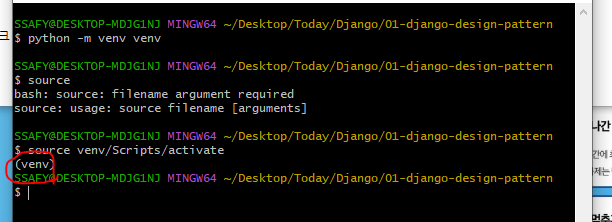
  켜져있다를 의미(위)
  끌 때는 `deactivate`를 쳐 주면 된다. (또는 git bash를 끄면 됨(아마 이걸 많이 씀))

- 환경에 설치된 패키지 목록 확인
  

- 패키지 목록 공유(필요)
  
  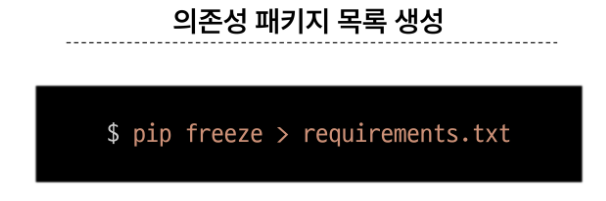
  
  - 패키지 목록만 공유하는 이유: 크기가 크다....(txt만 공유)
  
  - 공유하기 위한 txt 만들기(의존성 패키지 목록 생성)
    이것도 이름 requiremants.txt로만 씀
    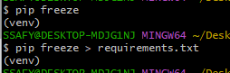
  
  - txt를 통해 패키지 목록 쫙 다 받기(일일히 하나하나 받기 힘드므로) (받을려는 폴더에 이 txt가 있어야 됨)
    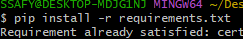

- 의존성 패키지
  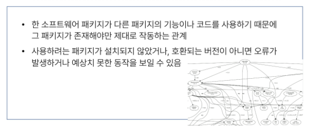

- Django 프로젝트 생성 전 루틴
  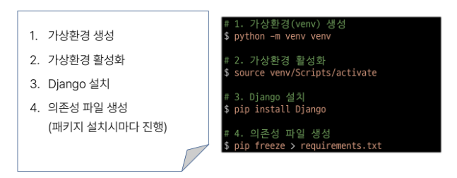

- Django 프로젝트 생성(이거 시험에 은근 나옴, 프로젝트 만들고 쓸 일 없어서 까먹음)
  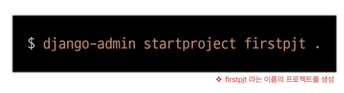
  뒤에 . 붙일것!!!(현재 디렉토리에 만들기!)
  실수로 안 찍었으면, 삭제 후 다시 하기

- Django 서버 실행
  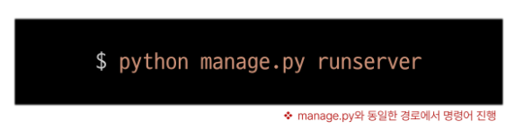

### 참고

  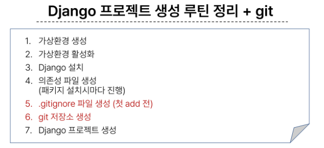

- LTS
  
  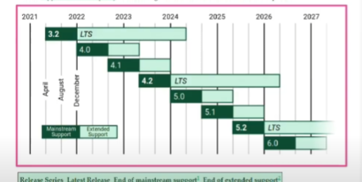
  .2 버전을  메인으로 함(장기적으로 지원되는 안정적인 버전)

### Django Design Pattern

#### Django 프로젝트와 앱

- Django project
  
  - 애플리케이션의 집합
    (DB설정, URL 연결, 전체 앱 설정 등을 처리)

- Django application
  
  - 독립적으로 작동하는 기능 단위 모듈
    (각자 특정한 기능을 담당하며 다른 앱들과 함께 하나의 프로젝트를 구성)

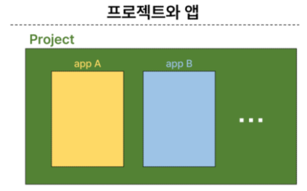

- 앱 사용 과정
  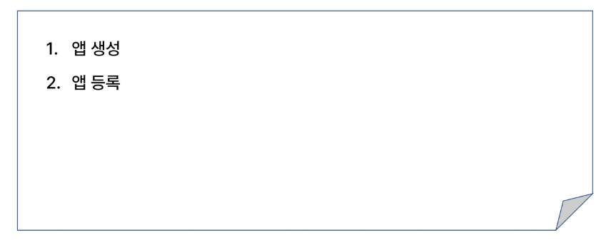
  앱 등록 빼먹지 말기!!(출생신고)

- 앱 생성
  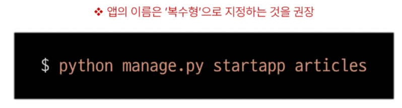
  
  참고: 프로젝트를 만들때는 manage.py가 없어서 이름이 좀 달랐는데..manage.py가 있는 이후 부터는 대부분이 해당 형식처럼임..
  
  앱 생성만 해서 등록해줘야 함을 표시(아래.)
  
  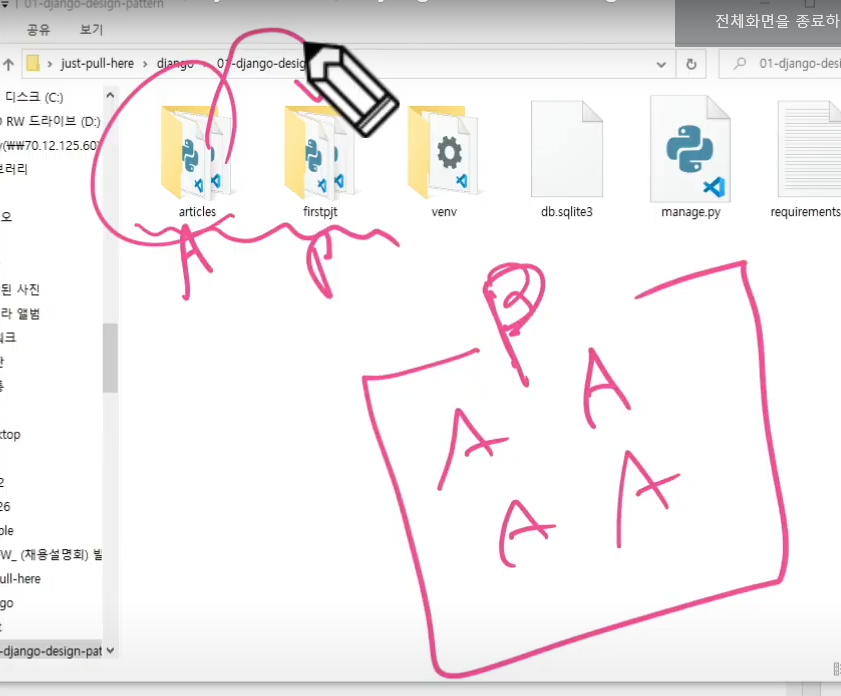
  프로젝트가 여러 앱을 포함한다고 설명해줬는데 위의 그림을 보면 물리적으로 포함되어있지 않음을 알 수 있다.(물리적으로 동일한 위치에 있다.) 그래서 프로젝트는 articles라는 앱이 생성된 것을 모름 -> 그래서 등록해주는 과정이 필요

- 앱 등록
  
  
  참고: 미리 등록해두고 만들어야지~ (이것도 안됨, 앱이 생성이 안됨)

#### Django 디자인 패턴

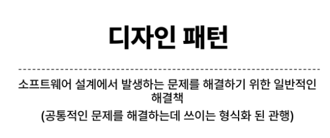

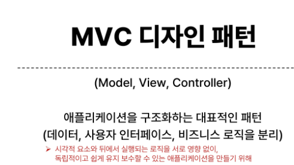
장고는 위의 것을 어느정도 본 따서 커스텀 함

모델: DB, View: 화면, Controller: 내부로직
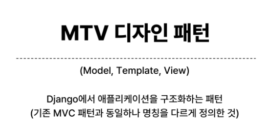
template 안에 html 파일들이 들어감
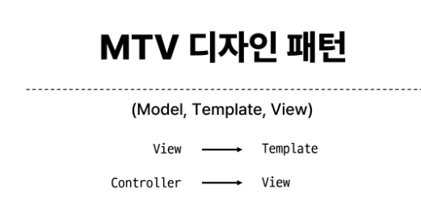
파이썬이 파이썬 했다고 보면 됨(청개구리)

- 프로젝트 구조
  
  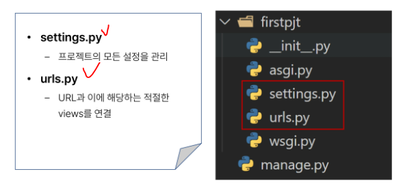
  urls.py -> url(사용)의 요청을 받아들이는 것이 서버에 필요한데 그 기능을 해줌
  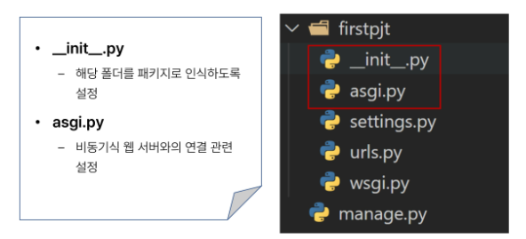
  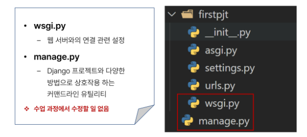
  체크한 것 말고는 수정 할 일 없음

- 앱 구조
  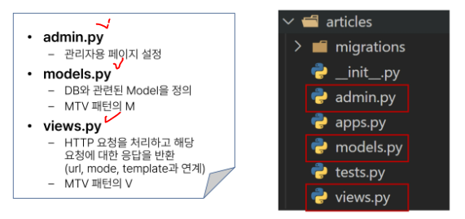
  views.py -> 가장 중요(컨트롤러 역할) (하는 일 많음)
  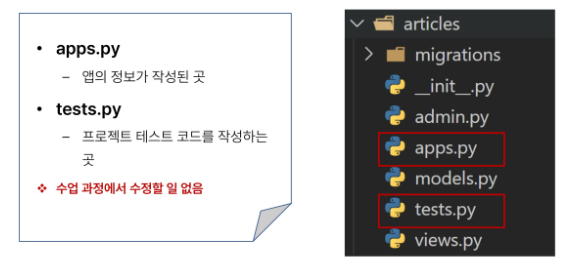

#### 요청과 응답

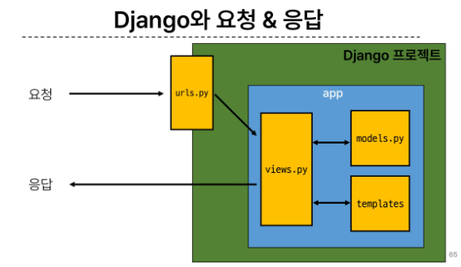
template - (사용자에게 보여지는 문서)

- URLs
  
  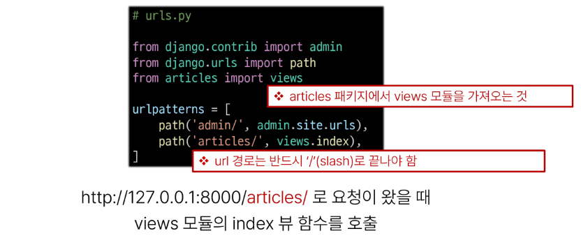

- View
  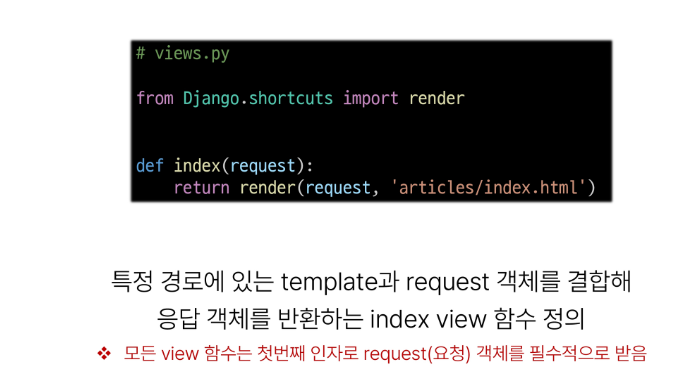

- Template
  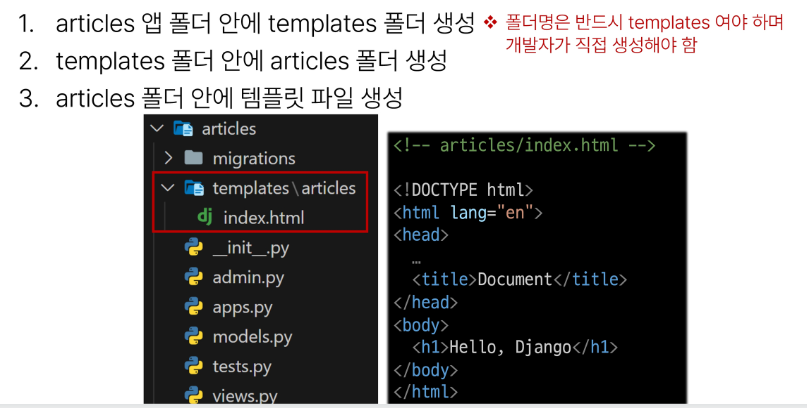

- Django에서 template을 인식하는 경로 규칙
  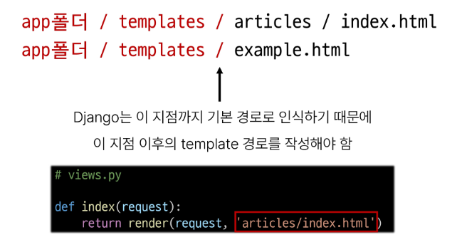

- 페이지 확인
  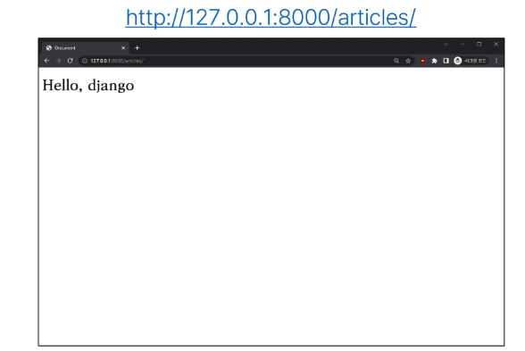

- 데이터 흐름에 따른 코드 작성
  
  

### 참고

- M T V가 어떤 역할을 하는지(뭘 의미하는 지) 알 것!!(찾아보고)

- MTV 디자인 패턴 정리
  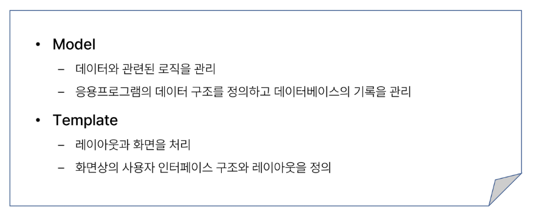
  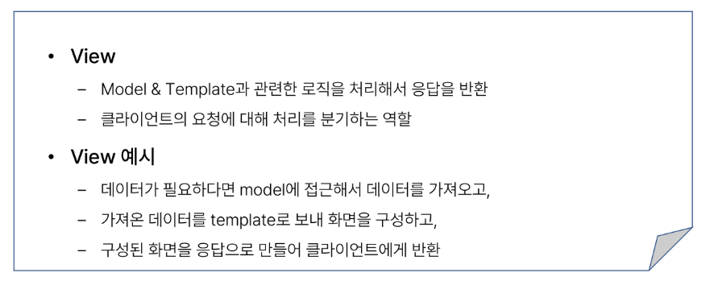

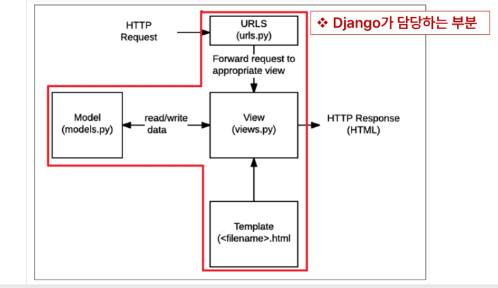

- render 함수
  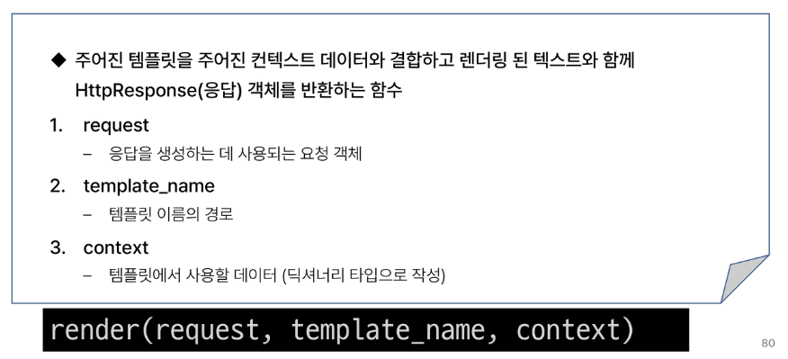
