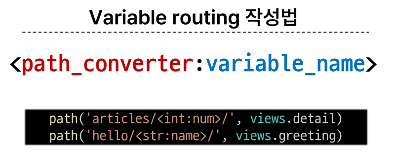
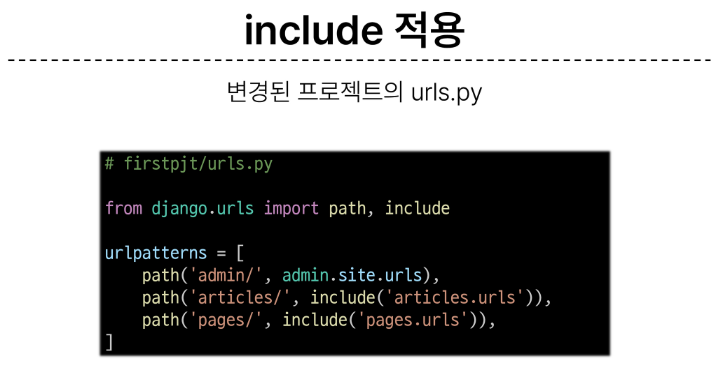

# 0913 TIL

## 잡다한 것

---

## Django Template & URLs

### Django Template

#### Template System

- Django Template system
  
  - 데이터 **표현**을 제어하면서, **표현**과 관련된 부분을 담당

- HTML의 콘텐츠를 변수 값에 따라 바꾸고 싶다면?
  

- Django Template Language(DTL)
  
  - Template에서 조건, 반복, 변수 등의 프로그래밍적 기능을 제공하는 시스템
    
    
    
    render 함수의 세번째 인자는 반드시 딕셔너리여야 한다.
    
    
    

#### 템플릿 상속

- **페이지의 공통요소를 포함하고**, **하위 템플릿이 재정의 할 수 있는 공간**을 정의하는 기본 'skeleton' 템플릿을 작성하여 상속 구조를 구축
  
  

#### HTML form(요청과 응답)

- action과 method
  

name: 서버로 보내는 키의 이름 역할을 함
키가 필요한 이유: 서버는 딕셔너리 형태로 받기 때문에 사용자가 입력한 것을 직접적으로 접근 불가, 그래서 키가 필요

### 참고

- 추가 템플릿 경로 지정(시험기출!!)
  
  
  
- 설명
  

### Django URLs

#### Django URLs

#### 변수와 URL

시험기출(아래)

#### App과 URL

#### URL 이름 지정

#### URL 이름 공간

