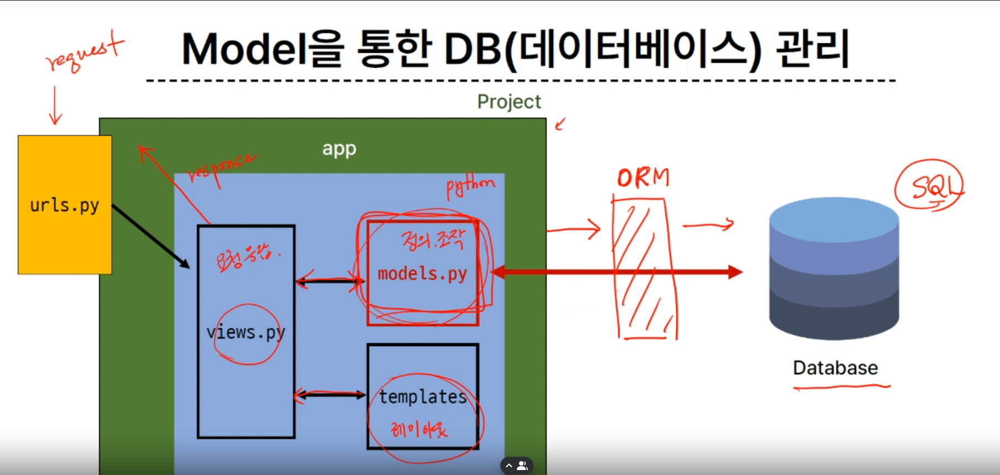
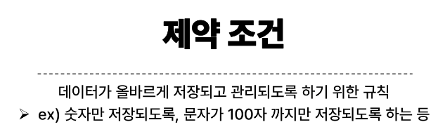

# 0914_TIL

## 잡다한 것

- MTV 중에 템플릿만 우리가 직접 만들어줘야하는 이유: 장고는 백엔드에 특화되어있어서

- 안전한 패스워드 저장
  [NAVER D2](https://d2.naver.com/helloworld/318732)

- DB가 gitignore에 속해있는 이유-> 중요한 정보를 공개된 원격장에 올린다구???

## Django Model

### Model

모델이 데이터 베이스를 의미하지는 않음, 모델이 데이터 베이스를 관리하는 느낌 

필드가 모여서 레코드가 되고, 레코드가 모여서 테이블이 됨, 또한 테이블이 모여서 데이터베이스가 된다.

- Django Model
  
  - DB의 테이블을 **정의**하고 데이터를 **조작**(생성, 수정, 삭제)할 수 있는 기능들을 제공
    
    - 테이블 구조를 설계하는 청사진

- model 클래스 작성
  

- model 클래스 살펴보기
  
  대문자로 시작하는 것은 대부분 클래스라고 보면 된다.
  id는 model 클래스가 알아서 만들어 줌
  
  
  레코드(행), 필드(열) 이라고 부른다.
  데이터 베이스는 반드시 column에 어떤 데이터가 들어가는 지 명시해야 한다.
  
  데이터 타입은 고정되어야 한다.
  
  

### Migrations

- model 클래스의 변경사항(필드 생성, 수정 삭제 등)을 DB에 최종 반영하는 방법

- 과정
  
  설계도 초안을 DB로 바로 못 보낸다. (DB는 파이썬을 몰라유, 언어 몰라), 그래서 makemigrations를 해서 DB가 알아볼 수 있도록 설계도 변환, 그리고 DB로 최종적으로 보내는 것을 migrate라고 함

- Migrations 핵심 명령어 2가지(중요)
  

앱이름_클래스이름

#### 추가 Migrations

- 추가 모델 필드 작성(테스트, auto_now_add 이런거 써보라 캄)
  
  필드가 무슨 역할? 각 필드의 데이터 타입을 결정
  
  
  
  여기서 2번째 이거는 1번째 설계도가 없으면 안됨(의존 중)(쌓아가는 느낌)
  

#### 모델 필드

- Model Field
  
  - DB 테이블의 필드(열)을 정의하며, 해당 필드에 저장되는 데이터 타입과 제약조건을 정의

(auto_now 와 auto_now_add test 나옴)

### Admin site(관리자 사이트)

관리자 사이트에선 기본적으로 장고의 내장 앱들에 한해서만 admin에 출력됨
-> 그래서 추가를 따로 해줘야 됨(위)

### 참고

설계도를 지워야 한다. 단순히 파일, 폴더 명을 변경하는 것만으로는 내장된 복잡한 함수들이 적용되지 않으므로 주의!!

