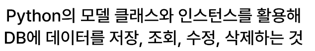
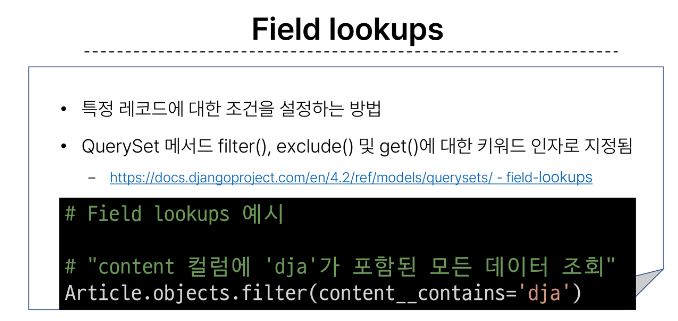
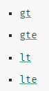

# 0915 TIL

## 잡다한 것

- 장고는 지워진 데이터에 대한 pk를 재사용 하지 않는다.

## Django ORM

### ORM

- 객체 지향 프로그래밍 언어를 사용하여 호환되지 않는 유형의 시스템 간에 데이터를 변환하는 기술

- ORM의 역할
  
  

### QuerySey API

- ORM에서 데이터를 검색, 필터링, 정렬 및 그룹화 하는데 사용하는 도구
  
  - API를 사용하여 SQL이 아닌 Python 코드로 데이터를 처리
    
    
    Queryset은 다중, instance는 단일 데이터

- QuerySet API 구문
  
  
  이 메서드를 사용할려면 매니저가 필요, 매니저가 메서드를 가지고 있다.

- Query
  
  쿼리를 보낸다 == "명령어를 보낸다." 라고 생각해주면 된다.

- QuerySet
  
  
  순회 가능-> for문 가능!!

- 오늘의 목적
  

### QuerySet API 실습

#### Create

- QuerySet API 실습 사전 준비
  
  -_

- Django shell
  
  

- 데이터 객체를 만드는(생성하는) 3가지 방법
  
  
  
  
  근데 왜 단일인데 인스턴스로 안 옴? all()은 전체를 달라는 의미를 가져서 쿼리셋만 받음
  단, 데이터가 없으면 빈 커리셋이 온다!!(중요)
  articles[0]으로 접근 가능(인덱스 접근)
  
  article.pk -> id임 그냥???
  
  
  데이터 베이스에 저장이 되지 않으면 article.pk해도 나오지 않음
  
  3번째 방식 안씀(유효성 검사 때문에)
  save()기능까지 탑제

#### Read(조회가 가장 내용이 많고 가장 중요)

만약에 조건을 만족하지 않으면 빈 쿼리셋이 나온다.
그리고 하나만 만족을 하더라도 쿼리셋으로 나옴

#### Update

수정을 할려면 조회가 먼저 이루어져야한다.(삭제도 마찬가지) -> 그래서 항상 get이랑 같이 많이 쓰일 것이다. 

#### Delete

### 참고

조건 더 세부적으로 조회 가능

크기(값 비교)

~로 시작하는 데이터, ~로 끝나는 데이터

