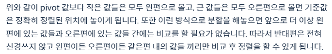
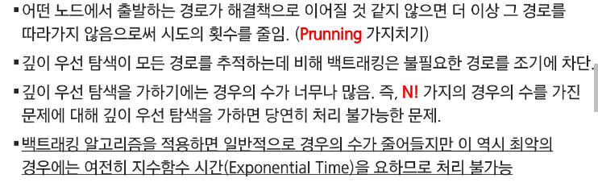
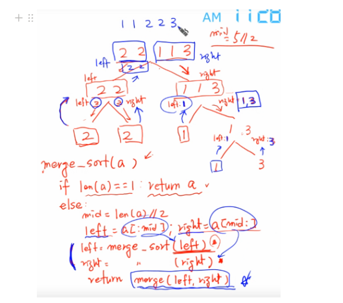

# 0918_0919 TIL

## 잡다한 것

- 지금까지 해온것들
  

- 병합 정렬과 퀵 정렬을 sort()랑 sorted()가 있는데 왜 배울까?
  

- Parametric Search (참고) (B형)
  
  - lower bound
  
  - upper bound
    
    - 여러 개의 데이터 중 2가 처음 나온 시점
    
    - 2~9 사이의 데이터는 몇 개인가?

## 분할 정복 & 백트래킹

### 분할정복

- 설계 전략
  
  - 분할: 해결할 문제를 여러 개의 작은 부분으로 나눈다. (나눌 수 없을 때까지== 문제를 쉽게 해결할 수 있을 때까지)
  
  - 정복: 나눈 작은 문제를 각각 해결한다.
  
  - 통합: (필요하다면) 해결된 해답을 모은다.

- 사용 예: 병합 정렬, 퀵 정렬, 이진 탐색

### 퀵 정렬 & 병합 정렬

- 병합 정렬(Merge Sort)
  
  - 배열 이용 x(유사한 배열에 대해 계속해서 복사를 반복하면 느려짐)
    
    - 그래서 Linked list 이용(그냥 잘라서 붙이면 됨)
  
  - 여러 개의 정렬된 자료의 집합을 병합하여 한 개의 정렬된 집합으로 만드는 방식
  
  - 과정
    
    
    반복하는데 구조가 변하지 않는다?? -> 재귀로 구현
  
  - 병합 방식-> i랑 j 비교하고 움직임(더 작은 놈을 result에 붙여주고  pop(0)), 한 쪽이 다 돌아갔다?? 그러면 덜 돌아간 쪽의 것이 다 돌아간 쪽보다 나머지는 전부 크다는 것을 알 수 있고 다 result의 뒤에다가 보지도 말고 달아주면 됨 

- 알고리즘
  
  

- 퀵 정렬
  
  
  
  
  아무 임의 값이나 해도 상관이 없지만 주로 처음, 중간, 마지막 값으로 할 때 퀄리티가 좋아서 처음, 중간, 마지막 값 이용, 
  아니면 처음, 중간 , 마지막 값 비교 하는 것도 지연 있으니깐 그냥 맨 앞 놈으로 함
  
  
  언제까지?? i와 j가 교차되는 시점까지 진행 (1 사이클)
  
  위의 방식은 Hoare 방식, 아래는 Lomuto partition 알고리즘 방식
  Lomuto partition 알고리즘은 Hoare 보다 일반적으로 좋지 않아서 덜 중요
  
  이번엔 hoare 방식과 달리 i와 j가 같이 감, r(기준)은 맨 뒤로
  기준보다 작으면 i와 j 모두 ++, 기준보다 크면 j만 ++(언제까지? 기준보다 작은 것을 만날 때까지), j만 늘려가다가 만약에 기준보다 작은 것을 만났다 그러면 그때 i 바로 뒤에 것과 방금 찾은 j와 스왑을 해준다.
  j가 기준보다 작거나 같은 것을 만나지 못하면 i바로 뒤에 기준(r)이 옴(이때 단축이 되네)
  ~~핵심은 피봇의 위치가 어디인지를 찾는 것~~
  
  

- Hoare vs Lomuto
  Hoare이 좀 더 좋음
  Lomuto는 같은 숫자가 많으면 쓸데없는 스왑 많아짐..
  ~~Lomuto '='가 필요한 이유가 뭘까?~~

### 이진 검색(중요!!, 코테 단골 문제)

- 원하는 데이터를 빠르게 찾는 방법 중 하나

- 검색 과정
  

- 알고리즘
  
  

- 분할 정복의 활용
  
  단, 퀵 정렬은 역순 정렬 등 최악의 경우 O(N^2), 평균적으론 O(NlogN)

### 백트래킹

- 개념
  

- 백트래킹 Tip
  
  - 전체 경우의 수를 고려하고 그 중에서 가능성이 없는 경우의 수 제거

- 백트래킹과 싶이 우선 탐색과의 차이
  

- 절차
  

### 트리

#### 정리

- 트리란?
  
  - 사이클이 없는 연결 그래프
    
    - 사이클: 한 지점부터 출발해서 다시 본인 지점으로 돌아오는 것
    
    - 연결 그래프: 모든 꼭지점이 서로 갈 수 있다.
      
      - 중간에 끊어져서 갈 수 없다? -그러면 다른 트리
  
  - 사이클이 없는 무방향 그래프

- 이진 트리
  
  - 자녀 노드가 둘 이하인 트리
  1. 이진 트리 종류
     
     - 완전 이진 트리
       
       - 마지막 레벨을 제외한 모든 레벨은 꽉 차있어야 한다.
       
       - 마지막 레벨 노드는 왼쪽부터 채워져야 한다.
     
     - 포화 이진 트리
       
       - 모든 레벨이 꽉 차있는 것
  
  2. 순회 방법
     
     - 전위(부모->좌->우)
     
     - 중위(좌->부모->우)
     
     - 후위(좌->우->부모)
  
  3. 트리 저장 방법
     
     - 일차원 배열 저장 part 그림
       
       위의 그림은 인덱스를 0부터 시작한다고 생각
       1부터 시작한다면 
       N * 2 =왼쪽, 
       N * 2 + 1=오른쪽이된다.

- 이진 탐색 트리
  
  찾으려는 값이 루트보다 크면 오른쪽만 보면 되고, 작으면 왼쪽만 보면 된다.
  (이진 검색 + 트리 느낌)
  
  - 삽입 연산
    
  
  - 삭제 연산(조금 어려움)
    
    - 각 서브트리에서 가능한 데이터를 찾아와야 됨(이거랑 바꾸면 나머지 트리는 문제가 없다가 보장 되어야 한다.)
      
      - 왼쪽 서브트리의 가장 오른쪽 자식 노드과 오른쪽 서브트리의 가장 왼쪽 자식 노드은 1차원 배열로 봤을 때 내가 가운데를 지운다고 가정을 하면 이 가운데와 가장 가까운 데이터임을 알 수 있다.
        그래서 얘네 2개랑 바꾸면 문제가 없다.

### 실습문제 풀이

