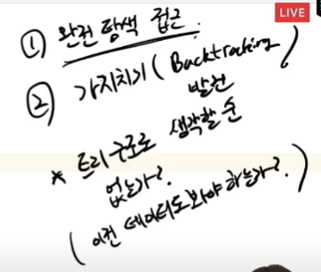
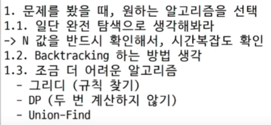
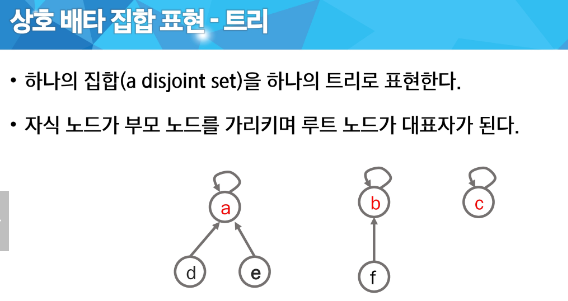

# 0920_0921 TIL

## 잡다한 것

- 백트래킹을 할 때 어떤 구조로 내려갈 지를 구상한 뒤 작성(그래야 기본 틀을 암)

- 서로소 집합 찾아볼려면 Union - find 알고리즘 찾아보기

- 배열은 원소의 타입이 모두 같아야 한다.

- disjoint-sets와 union find는 완전히 같진 않다.
  (disjoint-sets를 구하려고 union find를 쓰는 것이다.)
  
  (disjoint-sets는 자료구조 이름, union find는 알고리즘 이름이다.)

- 박트리 b형

- 최단 경로 pdf 볼 것

- Knapsack 문제 부분집합으로 가능

- 문제 접근 TIP
  

- 문제 풀이 정리(요약)
  
  

## 그래프

### 그래프 기본

- 그래프란?
  
  - 데이터 간 관계를 표현한 자료구조
    
    - 관계: 데이터 사이의 연관성
    
    - 노드와 간선으로 이루어져 있고..

### 그래프 탐색

#### DFS

- 스택과 재귀와의 차이점(참고)
  
  - 재귀는 처음으로 되돌아 온다.

#### BFS

- 하고싶은 일 enq때나 deq때 하면 되는데 주로 deq때 함, 왜냐 enq위치가 (처음 포함) 2군데라서

### 서로소 집합들

- 서로소 집합이란?
  

**대표가 같으면 같은 그룹이야!**

핵심-> 1. 대표자 저장, 2. 각 요소가 내가 속한 그룹의 대표자를 어떻게 찾을지??
(반드시 알고 갈 것!)

Make-set은 그냥 전체 집합에다가 데이터를 추가하는 것임
Union은 같은 그룹으로 묶어주는 것
Find- set은 너 대표가 누구니? 라고 물어보는 것

- 상호 배타 집합 표현 2가지
  
  1. 연결 리스트
  
  2. 트리

연결리스트는 다만, 데이터가 추가 되거나, 연결이 끊기거나, 새로운 연결이 생길 때 복잡...
(이러한 연산 불리)-> ~~그래서 코테때 트리 이용 많음~~

대표가 있니? 대표가 있니? 하며 계속 찾아감(젤 위쪽으로 올라갔을 때 무엇인가?)(재귀 쓰겠네)(부모가 자기 자신 가리키고 있으면 끝)

비효율적으로 한 칸 씩 찾아올라감을 해결(경로 압축)

서로 다른 트리를 합칠 때 어떤 것을 대표로 해서 합치는 것이 효율적일까?(위)
(더 적은 쪽을 합쳐주는 것이 나을 것)

### 최소 비용 신장 트리(MST)

문제1-> MST, 문제2-> 다익스트라(근데 못품, 가중치 관련된 것까지만 가능)

- 신장 트리란?
  
  1. **모든 정점을 연결**
  
  2. 사이클이 존재하지 않는 부분 그래프
     
     - 간선의 개수: N - 1개
  
  3. 한 그래프에서 여러 개의 신장 트리가 나올 수 있다.
     
     한 그래프(위)에서 여러개의 신장트리(아래의 4개)가 나옴을 알 수 있다
     
     
     
     
     ~~코드 짤 때 주의하세요->신장 트리 하나 구하고 나서 끝내면 안된다.~~
     
     ~~그 중에서 최소가 되는 것을 구해야 한다.~~

문제 예) 모든 도시에 갈 수 있도록 하며 가장 비용이 적도록(거리가 짧도록)

- 알고리즘 2가지
  
  1. 갈 수 있는 곳들 중 제일 짧은 곳으로 가자(모든 정점을 방문할 때까지)(정점 위주)
     
     - BFS랑 비슷, 가중치를 활용
  
  2. 전제 **간선**들 중에서 제일 가중치가 적은 곳부터 선택하자
     
     - 간선 정보 **정렬**
     
     

- Prim 알고리즘
  
  어디서 하든 결과가 같으므로 임의 정점을 하나 선택
  Union - find 알고리즘은 안 써도 되지만 방문여부 정보는 가지고 있어야 한다.
  사이클 체크를 안해도 되는 이유는?
  
  최소값, 방문체크(선택), 가중치 갱신 이 3가지만 하면 된다.
  
  ~~각 정점에서 남아있는 간선이 하나만 있도록 하면서 그 가중치가 젤 작은 것을 찾는 알고리즘인가??? 약간 다름... 우예 설명하지..(누적은 아니지만), 거쳐서 오는 것이 더 짧으면 여러개의 간선이 남아있을 수 있음~~
  
  
  그림 N자 방향으로 볼 것

- KRUSKAL 알고리즘
  
  

- 위의 알고리즘 대기업 코테에 나온 적 있음(요정도는 나올만 함)

### 최단 경로

- 다익스트라(Dijkstra) 알고리즘
  
  prim과 비슷한 것 아니야? 거리가 **누적**거리라는 점이 다름(가중치가 누적)
  
  prim과 똑같이 최소값 찾기, 방문체크, 인접정점 갱신 이렇게 작업 하는 것은 같은데 다른 점은 업데이트만 다르다.

 출발점부터 모든 노드에 해당하는 최단 거리가 나온다.

방문한 지점을 더 짧은 거리로 갈 수 있으니깐 visited는 굳이 필요가 없다. 대신 따로 저장해둔 누적 거리에서 걸러질 것(현재 누적거리랑 따로 저장해둔 누적거리랑 비교)
**즉, 누적 거리 배열 저장과 각 지점에 도달하는 누적 거리 기반의 우선순위 큐를 구현해야 한다.**

### 정리

